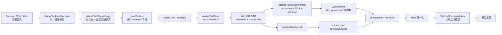
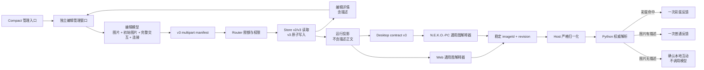
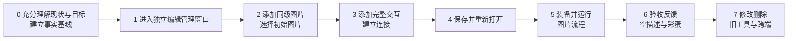
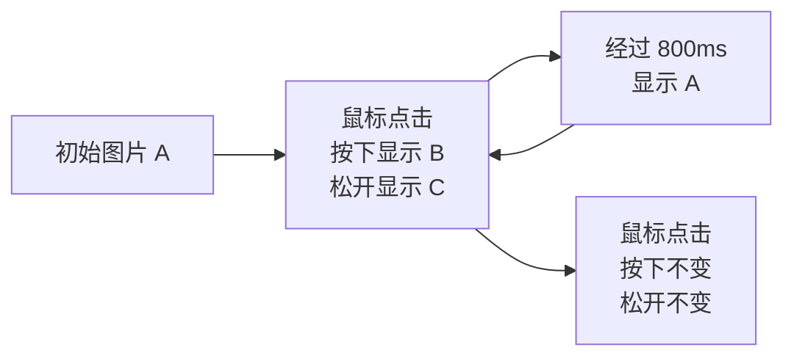

# Avatar 用户自定义通用道具实施与分阶段验收

> 状态：阶段 1、2 已收口；阶段 3 已进入全面审查整改、尚未收口；阶段 4 未开始
>
> 编写日期：2026-09-02  
> 产品语义基线：[Avatar 用户自定义道具图片交互功能设计](./avatar-tool-user-created-general-design.md)（已锁定）  
> 代码事实基线：`/Users/tonnodoubt/N.E.K.O` 与 `/Users/tonnodoubt/N.E.K.O.-PC` 当前工作区  
> 本文只安排如何实现和验收，不重新解释或改写锁定设计。

## 1. 实施目标与完成条件

本轮要把现有“默认图片 + `press-swap` / `click-advance` 固定模式”替换为真正通用的用户图片交互图，同时继续使用已有的本地文件选择、保存、装备、输入判断、音效、彩蛋、模型反馈、跨端投影和生命周期链。

只有同时满足以下条件才算实施完成：

1. 用户从 Compact 的现有道具管理入口可以进入足够大的独立编辑工作区，并能原路返回；
2. 用户可以管理同级图片、选择唯一初始图片、填写可选互动描述；
3. 用户可以创建完整的“鼠标点击”与“延时切换”交互，并连接出顺序、自连接、回连和不同触发分支；
4. 保存、重新打开、修改、冲突处理、删除和装备闭环完整；
5. Web、Full、Compact 与 N.E.K.O.-PC 对同一配置执行相同的点击、延时、竞争、取消和重置语义；
6. 正常点击只按按下前的图片决定普通反馈；空描述不调用模型；彩蛋命中只产生一次彩蛋反馈；
7. 旧 v2 自定义道具继续可用，并且只在用户明确编辑保存时转换为新结构；
8. 阶段 0 的现状与目标基线通过，并按本文阶段 1～7 完成人工验收和留证；
9. 所有自动化检查通过。

阶段 0 是开始实施前的强制理解与基线门；阶段 1～7 按用户实际使用顺序设置验收门。它们都不是允许单独发布的半成品版本。跨仓库代码仍必须按“消费者先兼容、生产者后输出”的顺序落地，全部阶段通过后才能发布。

## 2. 当前实际功能架构

### 2.1 当前运行链



当前事实与目标之间有四个结构性差异：

| 当前实现 | 目标实现需要 |
|---|---|
| 创建和修改仍嵌在受 Compact 几何约束的管理弹窗中 | Compact 保留入口，但连线编辑进入不受小弹窗限制的扩展工作区 |
| `recordVersion: 2` 只接受默认图、必填变化图描述和两种固定模式 | 版本化的新记录保存同级图片、初始图片、完整交互和连接 |
| Web/PC 解释器根据 `imageChange.kind` 和图片序号运行 | Web/PC 使用同一份图片交互图解释器和稳定 ID |
| 点击提交 `changeIndex`，Python 读取变化后的图片描述 | 点击提交按下前记录的稳定 `imageId`，Python 用权威记录决定彩蛋、普通反馈或不调用模型 |

### 2.2 必须复用的现有边界

以下能力已经存在且经过大量测试，实施时只能扩展，不能另起一套：

- `AvatarToolItemManager.tsx` 的管理入口、返回、目录刷新、编辑冲突提示和焦点管理；
- `AvatarToolCreatePage.tsx` 里的本地 PNG/MP3 选择、桌面 Host 文件选择、字段错误、音效、彩蛋、保存和删除流程；
- `avatar_tool_router.py` 的 loopback 权限、CSRF、上传限额和所有 `UploadFile` 关闭路径；
- `avatar_tool_store.py` 的严格记录校验、资源摘要、目录闭包、原子创建/更新、备份恢复、隔离和总占用限制；
- Web `runtime.ts` 已有的命中区域、同一指针/按钮、移动取消、最新边界、UI 排除、generation、锁和 surface ownership；
- N.E.K.O.-PC 的 contract、runtime、interaction output 与 surface lifecycle；
- Host 与 Python 的载荷白名单、修订校验、去重、冷却和反馈调度。

## 3. 目标功能架构



架构上保持一份权威记录、一个输入事实链和一个模型反馈入口。编辑器、Web runtime 与 PC runtime 都消费同一语义模型；各端只承担自己已有的展示和生命周期职责。

## 4. 编辑工作区实施决定

### 4.1 形态

采用“独立编辑管理页 + 复用现有编辑组件和数据链”。创建/修改不再塞在 `avatar-tool-manager-dialog` 内，也不改造承载 Compact 的透明特殊窗口；桌面端按现有模型/角色管理页的做法，由同源路由 `/avatar_tool_editor` 打开一个普通、不透明、可移动和可缩放的管理窗口。

具体行为：

- 用户仍在 Compact、Full 或 Web 的“管理道具”里点击创建或修改；
- Electron 桌面端使用命名窗口复用同一个编辑管理页，已有窗口存在时切换到新目标并聚焦，不重复堆叠窗口；
- 编辑窗口复用项目现有同源子窗口 preload、`window_controls`、居中边界和管理窗口分类，使用正常窗口拖动、最小化、最大化、关闭与原生边缘缩放；
- Compact 只保留入口和目录展示，不改变自身 bounds、最小尺寸、透明穿透、setShape 或 surface 生命周期；
- Web 场景复用同一编辑组件，在当前可用视口内显示，不建立另一套编辑逻辑；
- 保存或删除成功后通过已有目录刷新事件同步管理列表；关闭或返回只结束编辑页，不需要恢复 Compact 几何；
- 编辑页继续使用现有 API、目录状态和 mutation security，不形成第二份缓存、保存链或运行链。

### 4.2 工作区组成

工作区采用稳定的四区结构，不在 Compact 小面板里缩小节点：

1. 顶部命令区：返回、道具名称、保存状态、保存；
2. 图片与反馈资源区：同级图片、初始图片选择、可选描述、普通音效和彩蛋；
3. 中央视图画布：只显示完整的鼠标点击/延时交互及它们之间的连接；
4. 选中项设置区：修改所选完整交互的触发参数和图片动作。

画布使用 `@xyflow/react`，实施时新增并锁定依赖版本。项目当前是 React 18，尚未安装节点编辑库；选用它是为了直接获得成熟的平移、缩放、适配视图、小地图、边连接和键盘可达能力，而不是把通用状态机语义引入产品。小地图在图超出视口时显示并可折叠；触控板、鼠标与键盘都必须能完成导航和删除。

参考只用于验证编辑器可用性：

- React Flow 的[视口交互](https://reactflow.dev/learn/concepts/the-viewport)、[内置 Controls / MiniMap](https://reactflow.dev/learn/concepts/built-in-components)和[键盘与无障碍支持](https://reactflow.dev/learn/advanced-use/accessibility)；
- Stately 的[画布、连接和选中项详情面板](https://stately.ai/docs/design-mode)以及[不可达状态提示](https://stately.ai/docs/editor-states-and-transitions)；
- Rive 的[Graph、States、Transitions 分工](https://rive.app/docs/editor/state-machine/state-machine)。

本项目不照搬这些产品的开始节点、父子状态、guard、代码面板或原始事件。锁定设计里的“无开始节点、完整交互整体连接、简单闭环校验”优先。

## 5. 数据、API 与运行契约

### 5.1 v3 权威记录

新保存记录使用 `recordVersion: 3`。以下结构表达字段职责；实施时由前后端共享的测试样例锁定精确字段名和严格键集合。

```json
{
  "recordVersion": 3,
  "id": "local-<uuid>",
  "name": "道具名称",
  "images": [
    {
      "id": "img-<stable-id>",
      "name": "待机",
      "resource": "image-001.png",
      "meaning": "允许为空"
    }
  ],
  "initialImageId": "img-<stable-id>",
  "imageInteractions": {
    "initialImagePosition": { "x": 40, "y": 160 },
    "initialImageTargetIds": ["ix-<stable-id>"],
    "items": [
      {
        "id": "ix-click",
        "name": "挥手",
        "trigger": { "kind": "mouse-click" },
        "actions": {
          "press": { "kind": "keep" },
          "release": { "kind": "show", "imageId": "img-b" }
        },
        "editorPosition": { "x": 240, "y": 160 }
      },
      {
        "id": "ix-delay",
        "name": "恢复待机",
        "trigger": { "kind": "after", "delayMs": 800 },
        "actions": {
          "complete": { "kind": "show", "imageId": "img-a" }
        },
        "editorPosition": { "x": 560, "y": 160 }
      }
    ],
    "links": [
      { "from": "ix-click", "to": "ix-delay" },
      { "from": "ix-delay", "to": "ix-click" }
    ]
  },
  "interaction": {
    "normalSound": "normal.mp3",
    "special": {
      "probability": 0.1,
      "image": "special.png",
      "meaning": "彩蛋描述",
      "sound": "special.mp3"
    }
  },
  "resourceDigests": {
    "image-001.png": "<sha256>"
  }
}
```

关键约束：

- 图片 ID、交互 ID 在一次创建后稳定；重排画布、替换文件或改描述不得改变 ID；
- 图片和交互的 `name` 是可选编辑名称；空名称由界面按当前位置和类型显示默认序号名，交互类型由 `trigger.kind` 独立保存，不能从名称推断运行行为；
- `initialImageTargetIds` 只保存初始图片在画布中直接连接的互动 ID；它表达的是初始图片的出向连接目标，不是互动自身的“起始”属性；`initialImagePosition` 只保存这张真实入口卡片的画布位置；
- `keep` 是存储层对用户“图片不变”的明确表达，不新增第三种用户动作；
- 编辑坐标只影响重新打开时的布局，不参与运行判断；
- 描述始终为字符串，空字符串合法；运行投影只暴露 `hasMeaning`，不暴露描述正文；
- 彩蛋图片继续是现有彩蛋效果资源，不混入可显示、连接的普通图片项；
- 图片、交互、连接和延时上限由后端 `limits` 统一下发，前端不得另写一套数值；
- 资源摘要和目录闭包必须覆盖普通图片、普通音效和彩蛋资源；
- revision 前缀由记录版本产生，v3 为 `3-<digest integer>`，不能继续硬编码 `2-`。

### 5.2 创建与更新 API

现有平行数组字段容易在增加稳定 ID、已有资源和新上传后错位。v3 改为一个 JSON manifest 加重复文件字段：

- manifest 保存名称、图片 ID、描述、初始图片、交互、连接及每个媒体的来源引用；
- 新文件使用 `{ "kind": "upload", "index": n }` 指向重复上传字段；
- 更新时保留的文件使用 `{ "kind": "resource", "name": "..." }`；
- 每个上传必须被引用一次，每个资源名必须属于当前记录，不能出现重复引用、未使用上传或跨道具资源；
- Router 继续先做 mutation security，再限量读取并在所有成功/失败路径关闭上传；
- Store 在临时目录内验证 manifest、媒体、摘要和目录闭包后，继续用现有原子发布/回滚流程。

GET 列表返回可运行的 v2/v3 联合 DTO；GET detail 返回可编辑结构。只有 detail 包含描述正文。保存成功仍返回管理页且不自动装备。

### 5.3 Web 与 Desktop 运行投影

内置固定道具保持 definition v1；旧自定义道具保持 definition v2；新结构使用 definition v3，避免改变已有 profile 的含义。

v3 本地 profile 使用独立的 `custom-graph` 分支，至少包含：

- authoritative revision；
- 图片 ID 到 frame index / URL / `hasMeaning` 的只读映射；
- `initialImageId`；
- 初始图片直接连接的互动 ID、完整交互和后续 links；
- 现有 burst、touch zone、普通音效和彩蛋定义。

Web 的 `catalog.ts`、`desktopContract.ts` 与 PC 的 `contract.js` 对同一份 v3 fixture 做严格解析。v1/v2 分支不改语义，v3 只允许本地 UUID 道具。

### 5.4 图运行状态

每个已装备道具的运行状态只有：

```text
当前图片 ID
当前等待位置中的候选完整交互 ID 集合
候选延时的进入时间与到期时间
可选的进行中点击票据
现有 generation / surface ownership / disposer
```

进入初始图片的连接目标或某交互的后继位置时，建立候选集并为延时候选登记到期时间：

- 最先正常完成的候选成为唯一胜者，取消同级候选；
- 点击按下前先记录当前图片 ID，再执行按下图片动作；
- 点击按下后暂时占有该等待位置，同级延时到期只能记为待处理，不能插入按下与松开之间；
- 正常松开时执行松开动作、提交记录图片结果、前进到后继位置；
- 点击取消、移出或失焦时不执行配置的松开动作，而是恢复按下前图片且不前进，然后恢复原候选集；已经到期的延时随后立即按原到期顺序竞争；
- 延时胜出时执行到时图片动作并前进；选择“图片不变”时不切图，但仍正常前进；
- 无后继时停止等待并保持当前图片；
- 工具切换、revision 变化、surface handoff、失去 ownership 或销毁时，由现有 disposer/generation 取消旧票据和计时器并恢复新周期的初始图片；
- 不能建立独立的 document pointer 监听器或 PC surface 生命周期。

### 5.5 点击反馈载荷

v2 继续使用 `changeIndex`。v3 使用稳定 `imageId`，两者在同一载荷中互斥：

```text
toolId + toolRevision + imageId + touchZone + intensity + specialTriggered?
```

正常点击的处理顺序固定为：

1. runtime 使用按下前记录的图片 ID，不使用按下/松开动作后的图片；
2. 正常点击照常执行本地音效、彩蛋抽样和图片动作；
3. 彩蛋命中时提交一次彩蛋事实；
4. 彩蛋未命中且运行投影的 `hasMeaning` 为 true 时，提交一次普通事实；
5. 彩蛋未命中且 `hasMeaning` 为 false 时，不发送模型反馈事件，不占用互动冷却；
6. Python 仍以 tool revision 和权威记录复核 image ID、彩蛋配置和真实描述；即使客户端被篡改，空描述也不得进入提示词或模型；
7. 无效点击、取消或旧 generation 不提交事实，也不推进图。

Host 的 camelCase/snake_case 白名单、WebSocket 事实和 Python normalizer 同步增加 `imageId` / `image_id`，并继续拒绝未知字段。

### 5.6 v2 兼容与转换

- 列表、装备和运行继续读取 v2，不能在扫描、启动或 GET 时静默改文件；
- 用户打开 v2 编辑时，前端显示等价的新编辑模型；只有保存成功才由 Store 写成 v3；
- `press-swap` 转为一个自连接点击：按下显示旧变化图，松开显示旧默认图；
- `click-advance` 转为点击链：每项松开显示下一张旧变化图，最后一项自连接并保持最后一张；
- 旧默认图成为同级初始图片，描述为空；旧变化图描述、音效和彩蛋全部保留；
- 转换只保证旧视觉过程可表达；点击反馈改按按下前图片取描述是锁定设计要求，不宣称旧反馈无损；
- base revision 冲突仍返回最新 detail，不能覆盖另一窗口的新版本。

## 6. 阶段 0 与按用户步骤划分的七个实施阶段



阶段 0 用只读调查、当前功能实测和基线测试证明已经理解充分；阶段 1～7 必须用真实 UI 完成人工路径，不能用接口调用或测试代码代替。验收证据使用核对表、命令结果、截图、短录屏或聊天记录；不为此增加正式产品里的“预览”功能。

### 阶段 0：充分理解当前情况与目标

**目的**

在修改功能代码或安装依赖前，确认当前起点、目标边界、主要代码落点和实施阻断。阶段 0 只回答“能否安全开始实施”，不提前重做阶段 1～7 的用户验收。

**执行边界**

- 只读取文档、代码、配置、测试和本地非敏感运行状态；
- 可以运行与本功能直接相关的现有测试和必要的当前界面抽查；
- 不修改功能代码、数据结构、依赖、用户已有本地道具或锁定设计；
- 不把历史助手结论、旧文档描述或外部方案当作当前代码事实；
- 发现锁定设计与当前事实之间存在未被实施文档处理的业务分歧时，停止进入阶段 1，提交给用户确认，不自行修改锁定设计。

#### 0.1 确认目标和现状

完整读取锁定设计和本实施文档，并核对当前实际代码。记录以下事实即可：

- 两仓库分支、版本、工作区已有内容和本功能依赖；
- 当前管理、创建、API、Store、Web 运行、Desktop 投影、PC 运行、Host/Python 反馈的主链；
- 当前 v2 与锁定目标之间的结构差异；
- 阶段 1～7 各自负责实现和人工验收什么。

只需建立到模块和阶段的映射，不要求在阶段 0 为每个字段制作截图、fixture 和独立用例。

#### 0.2 建立最小基线

运行能够证明现有道具链未在实施前损坏的最小检查：

```text
N.E.K.O 前端类型检查 + 本功能相关测试
N.E.K.O Python Store / Router / 反馈契约测试
N.E.K.O.-PC 本功能相关 contract / runtime / lifecycle 测试
```

已有的整仓检查结果可以引用，但不为阶段 0 强制重复跑全量测试、构建、Electron smoke 或所有平台组合。失败只需区分为“本功能阻断”“实施前无关失败”或“当前环境不可运行”；阶段 0 不顺手修复。

阶段 0 不再要求创建两个临时道具、制造 revision 冲突、逐个 surface 重放完整闭环或为当前旧界面录制全套证据。这些行为已有代码和测试可确认的，以代码和测试为准；真正的用户路径留在阶段 1～7 验收。

#### 0.3 验证关键技术路径

在不安装依赖、不写代码的前提下确认：

- 当前 Electron/React 宿主能否按已有模型/角色管理页模式打开同源独立管理窗口，同时不改变 Compact 的特殊窗口状态；
- 独立编辑页是否能继续使用现有目录状态、mutation security、Host 文件选择和同源刷新机制；
- `@xyflow/react` 与当前 React/TypeScript/Vite 版本、许可、CSP 和打包目标是否兼容，并记录拟锁定版本；
- definition v3 与现有 wireVersion、v1/v2 strict decoder 如何并存；
- v3 `imageId` 能否沿 Web、desktop contract、PC output、Host 和 Python 全链到达且不暴露描述正文；
- timer/ticket 怎样进入现有 disposer、generation 和 surface ownership，而不是形成第二套生命周期；
- v2 转换样例能否精确生成本文规定的新图，并保持资源闭包和 revision 冲突语义。

这里确认是否存在结构性阻断，不要求在阶段 0 写出 v3 decoder、图解释器或跨端实现原型。外部节点编辑器资料只能支持兼容性判断，不能改变锁定设计。

#### 0.4 阶段 0 交付物

阶段 0 只保存一份简短基线记录，不额外制造重复设计文档。记录包含：

1. 两仓库工作区状态与本功能相关版本/依赖；
2. 当前主链、目标差异和阶段 1～7 的落点；
3. 已运行的相关检查及实施前失败分类；
4. 关键技术路径是否可行；
5. 是否存在进入阶段 1 的阻断。

**阶段 0 人工验收门**

- [x] 当前主链、目标差异和必须复用的边界已经明确；
- [x] 本功能相关基线没有未分类失败；
- [x] 目标方案没有已知结构性技术阻断；
- [x] 两仓库已有用户内容已识别并会保留；
- [x] 没有未确认的业务问题。

**通过条件**：上述五项通过即可进入阶段 1。具体界面、运行结果和跨端一致性按阶段 1～7 的人工验收逐步证明，不在阶段 0 重复验收未来功能。

### 阶段 1：从 Compact 进入独立编辑管理窗口

**用户路径**

```text
Compact → 管理道具 → 创建自定义道具 / 修改已有道具 → 独立编辑管理窗口
```

**实施内容**

- 将 `AvatarToolItemManager` 的 `create/edit` 内容从当前小弹窗中拆出；
- 新增 `/avatar_tool_editor` 同源管理页和命名窗口打开/复用逻辑，编辑内容继续复用同一套 React 组件；
- 按模型/角色管理页的现有窗口链接入 child preload、标题栏控制、正常拖动、原生缩放、最小尺寸和显示时机；
- Compact 不扩窗、不切换 `resizable`、不增加自定义缩放 IPC，也不改变透明区域和鼠标穿透契约；
- 保留管理器 session guard、目录刷新、编辑冲突处理和现有 Web 回退；
- 接入画布 viewport、Controls、按需 MiniMap 和中文无障碍文案；
- 编辑窗口是独立的不透明交互面，不依赖 Compact 的模型拖动、点击穿透或 setShape 采集。

**人工验收**

- [x] 在 Compact 点击“创建”或“修改”后打开独立编辑管理窗口，不改变 Compact 的位置、尺寸、穿透和可缩放状态；
- [x] 编辑窗口可通过标题栏移动，可从系统窗口边缘缩放，并能最小化、最大化和关闭；
- [x] 图片区、画布和设置区文字、按钮无需缩到难以阅读；真实边界连线随阶段 3 产生后继续验收；
- [x] 画布可点击、平移、缩放、适配视图；节点和连接的键盘焦点契约已用示例节点验证，真实流程随阶段 3 继续验收；
- [x] 保存/删除后原管理列表刷新；关闭或返回后 Compact 仍保持原状态；
- [x] 从 Full/Web 进入时复用同一编辑组件、接口和数据模型，不出现第二套业务实现。

**留证（2026-09-02 收口）**：

- `.agent/evidence/avatar-tool-stage1-2026-09-02/compact-entry.png`；
- `.agent/evidence/avatar-tool-stage1-2026-09-02/editor-full.png`；
- `.agent/evidence/avatar-tool-stage1-2026-09-02/open-move-resize-close.mov`。

**阶段 1 实施记录（2026-09-02）**

- 状态：阶段 1 的代码实现、真实桌面/Web 验收与留证均已完成，阶段 1 已收口；
- 纠错：此前把“复用同一编辑能力”错误实现为临时扩展 Compact 特殊窗口，引出了穿透、setShape、拖动、缩放、最小尺寸和退出恢复等本不应由编辑器承担的问题。此前基于该承载方式的截图、录屏、勾选项和“实现完成”结论全部作废；
- 当前结构：`AvatarToolItemManager` 只负责入口和目录；Electron 的创建/修改打开 `/avatar_tool_editor` 命名管理窗口，编辑页复用 `AvatarToolEditorWorkspace`、`AvatarToolCreatePage`、现有 catalog/API 和 mutation security；Web 继续复用相同组件；
- 窗口链：编辑页沿用现有同源 child preload 与 `window_controls`，PC 把该路由归入普通管理窗口，采用不透明、可移动、可缩放、有最小化/最大化/关闭能力的窗口；Compact 的 bounds、resizable、透明输入区域和生命周期不再参与；
- 已撤销：此前为 Compact 编辑 workspace 增加的最小尺寸覆盖、bounds 扩展/恢复、八向缩放坐标桥接、强制关闭穿透和额外几何采集均已移除，对应错误测试也已删除；
- 当前功能：窗口标题继续表示“创建自定义道具 / 修改自定义道具”这一整页动作；页面内部按实际职责分为左侧“互动流程”和右侧“道具编辑”，右侧再以“道具设置 / 互动设置”区分内容属性与所选互动，不再用“流程 / 图片交互画布”重复描述左栏；左侧已有平移、缩放、适配视图、键盘焦点、中文无障碍标签以及节点达到 4 个时出现的 MiniMap。当前旧 `definitionVersion: 2` 表单只作为阶段 1 的道具内容继续工作，图片同级化和真实交互节点从阶段 2、3 实施；
- Web 收口修正：共享的 `/chat`、`/chat_full` 模板在 Web 也静态带有 `electron-chat-window`，不能用它识别 Electron。现改为只认 `__LANLAN_IS_ELECTRON_PET__` 或模板注入的 `neko-electron-runtime`；实际 Web 创建入口已恢复为同页编辑 workspace，桌面仍打开独立窗口，并增加对应回归测试；
- 自动验证：前端 TypeScript 类型检查和生产构建通过；全量 `19` 个测试文件、`522` 个测试通过；N.E.K.O.-PC 的窗口契约定向测试 `55` 项通过、`1` 项按环境跳过，无失败；此前 N.E.K.O 相关静态/路由资源 `111` 项和 N.E.K.O.-PC 组合测试 `199` 项通过、`35` 项按非当前平台跳过的基线继续成立；
- 实际桌面验证：完整重启后从 Compact 依次打开“头像道具 → 管理道具 → 创建道具”，得到居中的 `1280 × 900` 独立编辑窗口。打开、保存、修改、删除和关闭编辑窗口期间，Compact 管理状态保持 `950 × 1041`、位置 `(-1779, 30)` 不变；编辑窗口实测可移动、缩放为 `1100 × 760` 后恢复 `1280 × 900`、最大化/恢复、最小化/恢复和关闭；默认尺寸及缩至 `1280 × 820` 时保存按钮均完整可见；
- 数据闭环验证：通过独立编辑窗口真实创建临时道具，保存后原管理列表和 `/api/avatar-tools` 目录同步出现；再从管理列表打开修改窗口并删除，原列表立即移除且目录恢复为空，临时数据已清理；
- Full/Web 验证：桌面 Full 从相同管理器打开同一个 `/avatar_tool_editor`，再次点击创建只复用同一命名窗口；Web `/chat` 实际进入同页 `AvatarToolEditorWorkspace`，Compact、Full 和 Web 均复用同一 catalog/API 与数据模型；
- 画布验证：实际桌面页中的缩放控制把视图 `1.0 → 1.2`，滚轮平移改变画布位移，适配视图按钮可操作；React Flow 的示例节点/连接测试覆盖键盘焦点、中文 Controls 文案和按需 MiniMap。真实图片节点和边界连线仍按阶段 2、3 的用户路径实施，不反向复杂化阶段 1；
- 收口结论：六项阶段 1 人工验收均已通过，当前没有进入阶段 2 的阻断。

### 阶段 2：添加同级图片并选择初始图片

**用户路径**

```text
填写名称 → 添加图片 A/B/C → 选 A 为初始图片 → 分别填写或留空互动描述
```

**实施内容**

- 建立稳定 image ID 的编辑状态；
- 复用现有本地 PNG/桌面 Host 选择、大小与像素错误；
- 去掉“默认图/变化图”和两种模式的 UI；
- 每张图片提供初始图片单选与可选描述；
- 图片被动作引用时，删除入口明确指出引用位置并阻止产生悬空引用；
- 图片错误按稳定 ID 定位，不再依赖变化图片数组序号。

**人工验收**

- [x] 添加三张外观可明显区分的 PNG，三张在 UI 中地位相同；
- [x] 任意图片都能被改为唯一初始图片；
- [x] A 填写“这是 A”，B 描述留空，C 填写“这是 C”，均可继续编辑；
- [x] 替换图片文件后 image ID 与所有引用不变；
- [x] 尝试删除已被交互引用的图片时被阻止，并能看出需要修改哪个交互；
- [x] 删除当前初始图片前必须先选择另一张；单选控制不会产生两个初始图片。

**留证**：图片区截图，需同时看到三张同级图片、唯一初始标记和一个空描述。

**阶段 2 实施与结构复核记录（2026-09-02～2026-09-03）**

- 状态：同级图片资源的功能实现、内部结构、自动化验证和当前实际 Web 编辑页验收已完成；阶段 3 已接入真实互动状态，并在实际编辑页完成被“按下时”引用的图片删除阻断，因此阶段 2 的最后一项联验也已完成；
- 结构边界：图片编辑不再继续堆在 `AvatarToolCreatePage`。`avatarToolEditorModel` 单独维护稳定 ID、唯一初始图、当前选中图和增删改不变量；`avatarToolImageFile` 只负责 PNG 文件校验；`AvatarToolImagePanel` 只呈现同级图片区和所选图片详情；`AvatarToolCreatePage` 作为页面协调层连接名称、文件选择、图片状态、音效、彩蛋、校验与阶段边界。现行 v2 DTO 和接口继续留在 `localTools`，不混入仅供新编辑过程使用的 image ID，也没有提前建立第二套 v3 数据模型；
- 编辑状态：新增稳定 `img-<uuid>` 图片 ID；旧 v2 详情打开时投影为同级图片，旧默认图使用确定的 `img-v2-default`，旧变化图使用确定的 `img-v2-change-<序号>`，首次打开和同一编辑会话内保持稳定；
- 图片区：创建页已移除“默认图片 / 变化图片”和 `press-swap` / `click-advance` 两种固定模式，只显示同级图片卡片、唯一初始图片单选、替换、删除和当前选中图片的可选互动描述；普通音效和彩蛋继续复用原组件与选择链；
- 文件选择：Web 文件输入与桌面 Host picker 共用同一 PNG 校验；同时检查扩展名/MIME、字节上限、PNG 签名、IHDR 尺寸和总像素上限，错误按稳定图片 ID 保留在对应卡片；异步重复选择以最新一次为准；
- 引用安全：图片删除入口接受按稳定 ID 汇总的动作引用位置；存在引用时逐项显示位置并阻止删除，当前初始图片同样必须先改选后才能删除。阶段 2 已用组件级测试验证两个命名引用不会产生悬空删除；阶段 3 接入真实互动状态后，实际页面已验证“鼠标点击 1 · 按下时”引用会阻止删除并保留原图片；
- 实际页面验证：在当前 `127.0.0.1:48911/avatar_tool_editor?mode=create` 页面添加三张明显不同的现有 PNG；A 填“这是 A”、B 留空、C 填“这是 C”；三张均呈现为同级卡片且只有一个初始图片。实测改选、替换 B、阻止删除当前初始图片、改选后删除均正确，替换前后 B 的 image ID 完全一致；重新补足三张图片后点击保存，页面正确停在“请完成初始图片入口连接”的阶段边界，没有误写回旧 v2；
- 文案与外观：新增阶段 2 文案已同步英语、简体中文、繁体中文、日语、韩语、西班牙语、葡萄牙语和俄语；画布空状态明确只承载完整交互及其连接，不再暗示图片卡片会放进画布；同级卡片补齐浅色/深色、键盘焦点、透明图预览、选中态和初始图片态；
- 图片区收口与桌面选择器修正（2026-09-03）：预览图固定在明确的预览框包含块内并使用 `object-fit: contain`，实际页面测得图片与约 `184×92` 预览框边界一致，`240×240` 原图完整可见；参照 WordPress Media Library 的“缩略图浏览 + 选中项详情”结构，卡片只承载缩略图、稳定图片序号和一行描述摘要，不显示本地文件名；初始图片使用贴近预览框左上角、与唯一初始图片选择一致的单选状态标记（外圈与实心圆点），不再使用容易与完成或当前编辑选中态混淆的勾选图标，也不增加初始卡片内圈边框；图片区网格下方用分隔线进入紧凑详情编辑区，初始图片单选右移到标题行右侧并紧邻删除左侧，删除仍是独立危险操作；更换图片严格复用 v0.1 的整行文件控件，左侧为“更换图片”，右侧显示当前文件名和从实际图片读取的原始像素尺寸，文件名与尺寸不回到图片卡片；不再使用“更多”菜单或把初始、更换、删除并排成三个按钮；图片区字号按详情标题 14px、主要字段与卡片标题 13px、卡片摘要与操作 12px、提示与计数 11px 统一，详情标题不再小于下方文件名；描述框默认按内容适配高度且不显示滚动条，只有实际内容超过详情区设定的最大高度时才启用内部滚动；图片区提示缩为只说明需要选择一张初始图片；N.E.K.O-PC 的 PNG/MP3 原生选择器只在请求来源为独立 `/avatar_tool_editor` 页面时绑定该编辑窗口，确保选择器位于编辑页之上，其他来源仍使用独立选择器，不重新绑定到 Compact 透明小窗；
- 自动验证：前端 TypeScript 类型检查通过；生产构建通过并同步实际运行 CSS；全量 `21` 个测试文件、`526` 项测试通过，相关 Python 契约、存储、路由、运行链和多语言缓存校验 `317` 项通过。阶段 2 定向覆盖三图/空描述、卡片描述摘要与所选图片完整编辑、纯模型不变量、唯一初始图、替换保留 ID、初始图删除约束、命名引用阻断、Host picker、非法 PNG、字节上限与像素上限；全量前端运行只出现已有测试环境的 `act(...)` 与媒体 API 提示，没有测试失败；
- PC 验证：原生选择器定向契约 `56` 项通过、`1` 项按平台跳过；全量合同测试 `610` 项通过、`40` 项按平台跳过；集成测试在不启用 Electron 冒烟时 `1` 项通过、`20` 项按条件跳过。额外启用跨仓库检查后 `11` 项通过、`9` 项按条件跳过，另有一项既有 Web UI 隐藏实现与 PC 旧正则不一致；PC 全量单测另有 `1191` 项通过、`5` 项跳过和 `5` 项集中在 `portable-update.test.js` 的环境失败（macOS `/private/var` 真实路径差异及 Linux `stat -c` 在 macOS 不可用）。这些失败均不经过本阶段改动的 `storage-gate` 文件选择器路径，记录为现有跨平台测试基线问题，不在阶段 2 内补丁式修改便携更新或其他页面逻辑；
- 锁定边界：本阶段没有写 v3 manifest、没有调用旧 v2 保存接口，也没有新增交互节点或运行时语义；N.E.K.O-PC 仅调整独立编辑页的原生资源选择器父窗口关系，没有扩大阶段 2 的数据或运行时范围；保存按钮在已有图片与名称合法时只提示需完成初始图片入口连接，避免把阶段 2 的编辑内容错误保存回 v2 后丢失。

### 阶段 3：添加完整交互并建立连接

> **阶段 3 审查标记（2026-09-04）**：全面审查未通过，当前不得收口或进入阶段 4。已确认问题、反例、阶段 4 前置契约和重新验收条件见 [阶段 3 全面审查](./avatar-tool-stage-3-comprehensive-audit.md)。下方实施记录只表示已经完成的实现过程，不代表审查结论；人工验收项在对应问题修正并重新验证前继续保持未勾选。

**开工准备（2026-09-03）**

- 阶段 2 已通过当前前端全量 `21` 个测试文件、`526` 项测试、TypeScript 类型检查和生产构建；同级图片、稳定 ID、唯一初始图片、替换保留引用和图片校验均保持通过。阶段 2 不再继续调整图片区；唯一未勾选项仍是下述真实互动接入后立即执行的阶段 2/3 联验；
- 当前画布已使用 `@xyflow/react` 提供视口、Controls、键盘焦点和按需 MiniMap，但节点、连接仍是 `AvatarToolInteractionCanvas` 内部的空临时状态；当前创建页持有图片编辑状态，并已提供按稳定图片 ID 汇总引用位置的删除阻断入口；
- 阶段 3 将建立一份由创建页协调的互动编辑状态，统一维护稳定 interaction ID、完整节点、初始图片入口位置和连接目标、后续连接、当前选中项及字段错误。画布只负责呈现和编辑这份状态，右侧只编辑当前选中的完整交互或连接，不再各自保存第二份节点或连接数据；
- 图片动作直接引用阶段 2 的稳定 image ID，并由同一互动状态派生图片引用位置交给现有删除阻断逻辑；真实节点接入后先完成“被按下时 / 松开时 / 延时目标引用的图片不能删除，并准确指出互动”的联验；
- 本阶段只完成互动编辑、连线和保存前图校验，不提前实现阶段 4 的 v3 manifest/API/Store 保存，也不提前实现阶段 5 的运行时点击与计时器语义。现有 v2 读取投影继续保留，保存仍停在新结构尚未持久化的边界。

**用户路径**

```text
添加鼠标点击 → 设置按下/松开图片动作 → 添加延时 → 从初始图片连接首批互动 → 连接后续互动
```

**实施内容**

- 节点库只提供“鼠标点击”和“延时切换”；
- 图片和完整互动均可重命名；留空时使用现有序号默认名，互动节点把类型作为独立标识显示，不把类型或“交互事件”强制拼入自定义名称；
- 鼠标点击节点内部固定显示“按下时 / 松开时”，两项都可选图片不变；
- 延时节点只设置正数等待时间，以及到时“图片不变”或目标图片；
- 完整互动的四周边界均可直接拖出连接，不显示四个离散圆点；已有连线根据节点相对位置自动选择边界落点，并保留节点外间距、尽量绕开其它节点，按下/松开内部动作不承担连线；
- 画布显示用户实际选择的初始图片卡片，并允许它连接一项或多项完整互动；不绘制抽象开始节点，也不增加“起始互动”开关或徽标；
- 自连接使用节点外侧回环，双向连接使用分离路径，同侧多条连接错开落点；
- 全图概览以一个统一浮层承载预览、收起入口和位置选择，展开与收起状态都留在当前角落并随位置切换整体移动；位置图标直接显示小画布中的目标角落，不使用方向箭头；该设置属于本机编辑器视图偏好，不进入道具定义；
- 保存校验覆盖引用、可达性、重复边和同一等待位置的触发歧义；同一候选集最多一个鼠标点击，相同等待时长的延时视为无法区分，循环合法；
- 字段或连接错误同时在节点、设置区和保存错误摘要中定位。

**标准验收图**



这张图表示：第一次点击后同时等待延时回到循环或再次点击退出；`I3` 没有后继，因此退出时保持当时图片。

**人工验收**

- [ ] 画布可以建立上图；初始图片是唯一入口且没有额外起始开关，点击节点始终作为整体移动、复制、连接和删除；
- [ ] 任一节点可从四周边界直接拖出连线，画布不显示四个离散圆点；移动节点后落点自动调整，自连接、双向连接和同侧多线均可辨认；
- [ ] 画布可在“折线 / 曲线”之间直接切换；切换只改变连接线显示，不改变连接关系、用户选择的起止边或互动运行语义，重新打开编辑页仍保留本机选择；
- [ ] 全图概览以预览本身作为浮层并显示当前实际节点和视口；收起和位置入口使用不遮挡内容的紧凑工具组，概览在画布上方时工具组位于预览下方、概览在画布下方时工具组位于预览上方，鼠标进入概览或键盘聚焦时才显示这两个展开态操作按钮，位置选项只在需要时于同一工具行展开；不增加外围白色卡片或底部常驻设置栏，收起态仅保留紧凑图标入口；展开、收起和切换角落时整组控件原位变化且不会遮住同角落的其它画布控件；“画布已就绪”作为覆盖提示保持可见且不占用或改变其它控件布局；
- [ ] 页面中不存在“有效点击”“点击成立阶段”“释放事务”或 pointerdown/pointerup；
- [ ] 图片和完整互动都能重命名；自定义名同步出现在卡片、节点、图片选项和连接说明中，清空后恢复默认序号名，交互类型始终可见；
- [ ] 按下和松开都选择“图片不变”的 `I3` 可以保存；
- [ ] 延时切换可以选择“图片不变”，到时不切图但仍沿连接继续；
- [ ] `I2 → I1` 回连合法，节点不需要结束节点；
- [ ] 两个无法区分的点击放在同一等待位置时保存失败并准确标出；
- [ ] 未被初始图片沿连接到达的正式节点保存失败，自连接和完整循环不报终止性错误。

**留证**：一张完整画布截图，初始图片入口、动态连接和 `I1/I2/I3` 设置可辨认；另留一张全图概览换位截图。

**阶段 3 实施记录（2026-09-03）**

- 单一编辑状态：新增稳定 `ix-*` 互动 ID 和 `link-*` 后续连接 ID，由同一份状态维护完整节点、初始图片入口位置及目标集合、后续连接、当前选中项和校验结果；画布、右侧检查器和图片引用删除保护都消费这份状态，没有另建第二套流程数据；
- 完整互动节点：节点库只提供“鼠标点击”和“延时切换”。鼠标点击节点固定显示“按下时 / 松开时”，两项均可选择“图片不变”或同级图片；延时切换节点填写正数毫秒，并选择到时“图片不变”或同级图片。复制、移动、连接和删除始终针对完整节点，内部图片动作没有 handle；
- 画布体验：继续复用现有 `@xyflow/react` 视口、平移、缩放、适配视图和键盘焦点；初始图片以实际缩略图入口卡片显示，完整互动的四周使用不可见连续边界接收连线，不再绘制四个连接圆点。新建连线会把用户实际拖动的起始边和结束边保存为连接数据，节点移动后仍保持这两条边，只在旧连接没有选边信息时自动选边；在这个约束内，把节点外直线段、路径长度、折点、回退、节点避让以及实际发生的线线交叉或近距离重叠放进同一次正交路由决策。常规间距保留稳定的首尾直线段；两个面对面边界间距不足时按实际空隙缩短首尾段并直接走中间通道，斜向相邻且方向相容时使用紧凑直角，不再为了满足固定长度绕节点外圈；边界中央受阻时优先沿用户选定的同一条边移动落点避开节点，而不是穿过控件或更换边。只让路线附近且可能形成阻挡的节点和连线参与计算，远处对象不改变当前清晰路线。节点端口附近由统一扇出区分配落点，进入和离开同一侧的线一起排序，不再由线线避让制造端点前的小折返；初始图片连接、普通连接和自连接均保留用户选边，自连接、双向连接和同侧多线分别使用外侧回环、分离走廊和错开落点。移动节点后自动重新选路但不换边；新增节点围绕当前视口寻找不重叠位置，复制节点避开已有节点。所有固定尺寸节点同时向 React Flow 提供稳定的测量尺寸和四边 handle 几何，受控节点重建时不会丢失连线定位条件；拖动中的位置和 dragging 状态也完整接回受控节点，拖动开始、持续和结束不会用不完整节点覆盖库内状态。路由器对每条起止节点都存在的连接保证返回非空路径：重叠节点、同边同点等退化布局会先分开两个落点再使用确定的正交回退，180° 回折不会再被误删为普通共线点；自定义边仍以 React Flow 当前端点提供最后显示兜底，单次路由计算异常不会把已有连接渲染为空。画布工具栏提供紧凑的“折线 / 曲线”显示切换：折线继续使用当前正交路由，曲线恢复项目原先由 React Flow 默认提供的 Bézier 形态，并沿用当前路由确定的边界落点和起止方向；自连接使用已有外侧回环的加大圆角，避免曲线退化在节点边界上。该选择仅作为本机画布偏好记忆，不进入道具数据。选中连接保持主线宽度不变，以同一路径的半透明外层光晕和同步变色的箭头表达选中，主线与光晕均采用不随画布缩放变化的屏幕线宽；
- 概览体验：MiniMap 本身作为随位置移动的浮层，不再套外围白色卡片；节点提供与实际卡片一致的确定尺寸，保证缩略图呈现当前真实节点和视口。收起和位置入口合并为不覆盖缩略内容的紧凑工具组：概览在画布上方时工具组位于预览下方，概览在画布下方时工具组位于预览上方；鼠标进入概览区域或键盘聚焦工具组时才显示两个展开态操作按钮，四个位置选项仅在点击时于同一行横向展开。收起态缩为单图标入口并留在当前角落，重新展开仍在原处；四个位置按钮使用“小画布 + 目标角落”图标，不再使用方向箭头；无本机偏好时继续按互动数量决定初始显示，用户操作后记住本机偏好。“画布已就绪”改为底部居中的覆盖提示，不再为它偏移概览或预留布局位置；
- 设置体验：右侧总区使用“道具编辑”作为区域名，内部页签按实际职责命名为“道具设置”和“互动设置”。选中节点后右侧自动切到“互动设置”，显示完整节点名称、对应图片动作的实际缩略图，以及复制和删除；延时等待时间使用可直接输入的毫秒数值字段，目标图片同样显示实际缩略图。选中初始图片连接或普通后续连接后显示准确的“前一项 → 后一项”和删除连接。没有起始互动开关，也没有引入抽象开始节点、结束节点、条件守卫、代码面板、模式模板或内部事件名；
- 命名体验：图片区详情标题和互动设置标题均可直接重命名；空值继续派生“道具图片 + 数字”“鼠标点击 + 数字”“延时切换 + 数字”，自定义名称同步用于图片卡片、初始图片节点、图片动作选项、互动节点、连接说明、错误定位和图片引用提示。互动类型仍作为独立小标题和节点图标显示，名称不带强制前缀；本阶段只维护编辑态，阶段 4 随 v3 manifest 一并持久化，不改变模型描述或运行判断；
- 保存前校验：覆盖初始图片未连接互动、失效图片引用、非法延时、缺少延时到时动作、悬空连接、重复连接、正式节点不可达、同一等待位置多个鼠标点击，以及相同等待时长延时的歧义；延时选择“图片不变”、自连接、回连、完整循环和无后继节点均不会因“无法终止”被拒绝；
- 错误定位：保存失败后保留当前编辑内容，自动切到互动设置并选择首个实际问题；问题同时体现在初始图片入口、红色节点或连接、当前设置字段/节点提示和可点击的错误摘要；
- 图片联验：图片动作直接引用阶段 2 的稳定 image ID；实际页面用两张真实 PNG 配置“鼠标点击 1”的按下图片后，删除该图片会显示“鼠标点击 1 · 按下时 正在使用这张图片”，且图片没有被删除；
- 旧数据投影：旧 `press-swap` 打开时投影为初始图片连接一个自连接的完整点击；旧 `click-advance` 投影为初始图片连接完整点击链的第一项，链尾继续回到自身，并保留旧图片资源、描述、音效和彩蛋。用户编辑期间只看到新的完整互动结构，不再出现旧模式选择；
- 成熟参考：画布采用 React Flow 的[受控节点和连接](https://reactflow.dev/learn/concepts/adding-interactivity)、[多方向 Handle](https://reactflow.dev/learn/customization/handles)和[Floating Edges](https://reactflow.dev/examples/edges/floating-edges)；曲线直接复用其默认 [BezierEdge / `getBezierPath`](https://reactflow.dev/api-reference/utils/get-bezier-path)，不另造视觉不一致的曲线算法。连线路由吸收 [yFiles EdgeRouter](https://docs.yworks.com/yfiles-html/dguide/polyline_router/) 的正交路径、首尾最小直线段、折点和交叉成本原则，以及 [ELK Edge-Node Spacing](https://eclipse.dev/elk/reference/options/org-eclipse-elk-spacing-edgeNode.html) 的边线与节点留距原则，但保持用户节点位置不变，也不为当前规模引入重型自动布局依赖；全图概览采用 React Flow 的 [MiniMap 位置与交互接口](https://reactflow.dev/api-reference/components/minimap)，右侧检查器继续参考 [Stately Design Mode](https://stately.ai/docs/design-mode) 的画布选中项详情结构。只采用与本项目直接相符的编辑器交互，不引入通用状态机概念；
- 实际页面验证：在 `127.0.0.1:48911/avatar_tool_editor?mode=create` 使用真实 PNG 完成图片添加、点击按下/松开配置、延时目标配置、初始图片入口连接、完整节点拖动、四边连接、自连接、回连、连接检查器、概览显隐换位、不可达错误定位、合法循环校验和图片引用阻断；连续添加三个节点和复制/删除节点均未发生堆叠或控制台错误。另将两个错位节点移动到水平仅余约 7px 的间距，从相对的右边连接左边，实际成线只使用这条窄通道，并在同一选边内把两端落点移近，没有再绕到节点外圈。补充在最窄单栏编辑布局中实际检查“折线 / 曲线”控件，两项均完整可见且选中态明确；切到曲线后刷新页面仍保持曲线，本机偏好记忆生效。针对连线消失问题，在包含初始图片连接和普通连接的真实 React Flow 画布上使用实际鼠标轨迹拖动两个已连接节点，并逐项执行画布平移、放大、缩小、适配视图、折线/曲线切换、新增节点和展开概览，两条已有连接始终存在且路径随节点位置更新；另把两个不同节点完全重叠并固定为同一上边连接，连接仍生成非空路径；
- 自动验证：TypeScript 类型检查通过；前端全量 `23` 个测试文件、`570` 项测试通过；多语言缓存契约 `5` 项通过；生产构建通过并同步实际运行 CSS。新增定向覆盖标准验收图、完整节点复制/删除、稳定图片引用、旧 v2 投影、合法循环和无终点、不可达节点、点击/延时歧义、连续添加不重叠、节点及端点直线段避障、远处节点与连线不干扰、无遮挡直线、首尾稳定直线段、拥挤端口回退、双向线与同侧多线分离、用户选定起止边在成线和移动后保持、初始图片连接和自连接选边，以及 1/8/30/59/60/61px 临界间距、贴边节点、斜向近邻、近距离双向线、多线共边、中央受阻时同边换落点和全部起止边组合，以及重叠、相交、贴边、近距和远距布局下全部起止边始终生成非空有限路径，曲线端点方向、自连接不退化、线型切换、节点移动与选中更新后保持连接渲染、本机偏好记忆、真实创建页的引用阻断和错误摘要；

**阶段 3 连线路由性能收口（2026-09-04）**

- 路由计算不再把一次节点移动等同于整张图重建。画布把连接拓扑、节点几何和连接呈现拆开：选中项、错误提示、检查器字段和折线/曲线显示切换不会重新规划路线；节点移动时只重算与该节点直接相连、因新位置被阻挡或共享边落点排序确实变化的连接，其余连接直接复用上一条有效路线。移动到远处的无关节点不会触发连线更新，移动节点进入既有路径时则会使该路径立即重新避障；
- 单次寻路先检查无遮挡直线或单折线路径，只有需要绕开节点或既有连接时才建立搜索网格。搜索范围只纳入起终点附近可能相交的节点和线段；既有连接预先拆成带边界的线段，一次寻路内复用，不再在每个候选移动上重复压缩、拆解全部路径。已保存起止边的连接不再先重复执行自动选边；同边落点先使用分组后的首选位置，只有该出口确实被控件阻挡时才按移动量由小到大尝试其它落点。近距离节点仍在便宜的紧凑路线集合内比较，保留窄缝、斜向近邻、双向线和多线扇出的原有结果；
- 控件与线的避让使用统一的节点外扩边界；远离候选路线的控件和线段先由包围范围排除，既有线段再以边界快速排除不可能发生交叉或近距重叠的组合。节点移动后，共享边连接只在重新排序后的实际落点发生变化时联动更新，不再粗略重算相邻节点的全部连接；正交路由仍同时权衡长度、折点、反向移动、交叉和近距重叠，不以性能为由取消已有避障规则；
- React Flow 层的节点、初始图片节点和自定义边加入按实际渲染字段比较的记忆化边界；未变化节点不再因另一节点移动重绘，未变化连接也不再因规划 Map 更新而重画。实现与 React Flow 官方[性能建议](https://reactflow.dev/learn/advanced-use/performance)保持一致；受影响连接的局部路由采用 yFiles EdgeRouter 的[路由范围](https://docs.yworks.com/yfiles-html/api/EdgeRouterScopeData.html?parameter-types=TNode%2CTEdge%2CTNodeLabel%2CTEdgeLabel)思路，节点与线的最小距离继续对照 [ELK edge-node spacing](https://eclipse.dev/elk/reference/options/org-eclipse-elk-spacing-edgeNode.html)，但没有引入新的布局依赖或改变用户节点位置；
- 性能基准：同一进程、同一测试数据下，`8` 节点/`12` 连接完整规划的中位耗时由约 `797 ms` 降至约 `6.7 ms`，`16` 节点/`32` 连接由约 `12.3 s` 降至约 `30 ms`；在后一个密集图中连续移动一个节点，局部规划中位耗时约 `18 ms`，每次至少直接复用 `27/32` 条路线。基准脚本为一次性诊断文件，结果记录后已删除，没有混入正式源码；
- 实际页面验证：在真实 React Flow 画布装入 `16` 个互动节点、`33` 条连接后连续移动节点 `10` 次；每次移动后 `33` 条连接均保持可见，路径均为非空有限值，没有 `NaN`、连接消失或控制台错误。自动验证更新为前端全量 `23` 个测试文件、`573` 项测试通过，生产构建和 CSS 同步通过；新增用例覆盖无关路线对象直接复用、移动控件进入旧路径时重新避障，以及共享边落点顺序变化时只更新必要连接。
- 语言一致性收口：主窗口打开独立编辑页时显式携带当前规范化界面语言；已经打开的同源编辑页通过 `i18nextLng` 的跨窗口存储事件继续跟随主窗口切换。互动画布的节点缓存把语言版本纳入显示更新条件，只刷新本地化文字，不重新规划连接路线；避免外层标题已经切换而初始图片、互动节点仍停留在旧语言。实际页面先以日文打开独立编辑页，再由另一同源窗口切到韩文，原窗口的系统标题、页面标题、初始图片节点、画布操作、设置页签和字段文案均同步为韩文。定向前端 `58` 项测试、i18n `37` 项单测、TypeScript 类型检查和生产构建均通过。

**阶段 3 连线操作体验收口（2026-09-04）**

- 本次只处理能够从当前页面直接复现并由成熟编辑器做法支持的操作反馈，没有再凭推测改路由规则。React Flow 把拖线中的 Connection Line 作为“可能建立的连接”并允许自定义，yFiles 在建立连接时显示候选落点及有效/无效反馈，Node-RED 则通过先选中再移动或删除连线、选中节点时强调相关连线来降低误操作；当前页面继续保持现有业务模型和四周连续边界，不新增端口类型、重连手势或通用状态机能力；
- 从四周不可见连续边界经过时，只在当前这一条边上显示细窄高亮；拖线期间保留起始边反馈，落到允许连接的边界时显示绿色，落到不允许连接的边界时显示红色。反馈只在操作中出现，不恢复四个固定圆点，也不把自由边界改成离散端口；
- 拖线预览现在跟随工具栏当前的“折线 / 曲线”选择：折线显示圆角正交预览，曲线显示 Bézier 预览；目标有效时使用绿色反馈，目标无效时使用红色虚线反馈。预览只表达当前手势，不写入连接数据，也不改变最终路线规划和用户选择的起止边；
- 已有连接增加悬停和键盘聚焦预提示，选中时继续使用同一路径光晕，主线宽度和箭头不因选择而变粗。当前同侧多线落点间隔为 `14`，React Flow 默认隐形命中宽度为 `20`，在实际双线场景中命中区会重叠；现显式收为 `12`，仍明显宽于 `2.2` 的可见主线，同时给相邻连接保留独立命中范围；
- 实际页面用一个节点同侧引出两条连接后，DOM 中两条线的隐形命中宽度均为 `12`，在相邻位置分别点击会依次选中两个不同连接；节点边界悬停只高亮当前一边，连接悬停只出现对应路径反馈。TypeScript 类型检查、生产构建和 CSS 同步通过；前端全量 `23` 个测试文件、`575` 项测试通过，新增覆盖折线/曲线拖线预览路径、显式命中宽度以及每条连接都具备悬停/选中反馈层。
- 参考依据：[React Flow Connection Line](https://reactflow.dev/examples/edges/custom-connectionline)、[React Flow Edge `interactionWidth`](https://reactflow.dev/api-reference/types/edge)、[yFiles Creating Edges](https://docs.yworks.com/yfiles-html/dguide/customizing_interaction_creating_edges/) 和 [Node-RED Wires](https://nodered.org/docs/user-guide/editor/workspace/wires)。
- 延时到时动作补充：延时切换与鼠标点击复用同一种明确图片动作，右侧“到时”下拉增加“图片不变”；节点摘要也改为“到时”，避免出现“然后显示图片不变”的矛盾表达。未选择仍是可定位的未完成状态，选择“图片不变”后节点摘要同步显示且保存校验通过，不产生图片引用，未来 v3 直接写为 `actions.complete.kind = "keep"`。实际页面已验证选择前后的下拉和节点摘要同步；前端全量 `23` 个测试文件、`577` 项测试通过，相关多语言契约 `42` 项通过，TypeScript 类型检查、生产构建和实际运行 CSS 同步通过。
- 自定义命名补充：图片详情和完整互动设置均直接在原有标题位置编辑名称，不增加有边框的输入框、额外名称卡片或改变原有标题字号；仅在键盘聚焦时显示轻量下划线。空值继续按当前位置派生现有默认序号名。自定义图片名同步到图片卡片、初始图片入口、图片动作选项和预览，自定义互动名同步到节点、连接说明、错误定位和图片引用提示；互动类型通过原有节点图标和设置区类型文字独立保留，不用“交互事件 + 自定义名称”制造重复标题。该结构与 [Node-RED 节点编辑](https://nodered.org/docs/user-guide/editor/workspace/nodes)将节点标签和节点类型/属性分开配置的做法一致，但只吸收命名与辨认原则，不引入它的端口或运行概念。图片与互动名称仅用于编辑辨认，不进入模型描述或运行判断；页面提示同步明确只有道具名称和当前图片描述会发送给模型。本轮前端全量 `23` 个测试文件、`580` 项测试通过，相关多语言契约 `42` 项、TypeScript 类型检查和生产构建通过，并在实际页面验证互动名称、原有类型提示和清空恢复默认名。

- 阶段边界：本阶段仍不写 v3 manifest、不调用旧 v2 保存接口，也不接入 Web/PC 运行时。内容和流程校验通过后页面明确停在“实际保存将在下一实施阶段接入”，避免把新图错误降级写回 v2；N.E.K.O-PC 本阶段不需要新增窗口或输入链修改。

### 阶段 4：保存并重新打开

**用户路径**

```text
完成配置 → 保存 → 返回管理页 → 再次修改同一道具
```

**实施内容**

- 完成 v3 manifest、Router、Store 校验与 v2/v3 DTO；
- 保存节点位置、初始图片入口位置及连接目标、每条连接由用户选择的起始边与结束边、图片稳定 ID、后续 links、音效和彩蛋；
- 继续使用原子发布、resource digest、目录闭包、总占用和 base revision；
- 保存失败保留编辑内容并聚焦首个实际错误；
- 保存成功刷新目录并返回管理页，不自动装备。

**人工验收**

- [ ] 保存标准验收图后只出现一个新道具卡片且未自动装备；
- [ ] 再次打开时图片、描述、初始图片、节点位置、连接、音效和彩蛋与保存前一致；
- [ ] 故意制造空名称、初始图片未连接互动、非法延时、悬空引用和不可达节点，分别得到可定位错误且页面内容不丢失；
- [ ] 两个窗口同时修改时，后保存的一方不能覆盖前者，会载入最新版本并提示冲突；
- [ ] 对应的原子更新与恢复自动化用例通过，证明中断写入不会破坏旧正式记录。

**留证**：保存前与重新打开后的同构截图、一次字段错误截图、一次 revision 冲突截图。

### 阶段 5：装备并运行图片流程

**用户路径**

```text
管理页选择道具 → 保存装备槽 → 点击 Avatar 或等待 → 查看图片按图运行
```

**实施内容**

- Web 和 PC 增加 v3 `custom-graph` 严格解码；
- 在已有 Web/PC pointer session 中接入图解释器，不增加全局监听；
- 使用稳定 image ID 驱动 frame，进入新周期显示初始图片；
- 所有延时进入现有 disposer/generation 生命周期；
- 实现候选竞争、点击占有、取消恢复、终点保持和循环；
- surface handoff、revision 变化和重装备清理旧计时器与旧点击票据。

**人工验收**

- [ ] 装备阶段 3 的标准图后首先显示 A；
- [ ] 正常点击时按下立即显示 B，松开显示 C；
- [ ] 松开后等待 800ms 会显示 A 并回到“鼠标点击 1”；
- [ ] 在 800ms 内开始 `I3` 点击，即使松开晚于 800ms，延时也不能插入按下与松开之间；完成后保持 C；
- [ ] `I3` 按下后移出、取消或失焦不会前进；对带按下换图的 `I1` 做同样操作会恢复按下前图片；恢复后延时仍按原进入时间处理；
- [ ] 快速重复 pointerup、不同 pointerId、拖动、UI 排除区和旧 generation 都不能重复提交；
- [ ] 卸载、换道具、修改当前道具或切换 owning surface 后没有旧计时器突然换图。

**留证**：一段完整录屏，包含点击 B→C、延时 C→A、点击抢先退出并保持 C。

### 阶段 6：按按下前图片产生反馈

**用户路径**

```text
点击 Avatar → 本地图片动作完成 → 有适用描述才收到一次反馈
```

**实施内容**

- v3 commit 和 desktop output 使用 `imageId`，不从变化后 frame 推导 `changeIndex`；
- Host、Python normalizer 和 `GreetingMixin` 按 recordVersion 严格选择 v2/v3 事实；
- 点击按下时先冻结图片 ID，再执行按下动作；
- `hasMeaning=false` 且彩蛋未命中时在客户端不发送模型反馈事件；服务端再做权威兜底；
- 彩蛋命中替代普通反馈，本地图片动作仍完成；
- 普通音效、彩蛋音效/散落效果继续沿用现有执行器。

**人工验收**

- [ ] A 描述为“只回答：A”，点击配置为按下 B、松开 C；第一次回复只能是 A，不能是 B 或 C；
- [ ] 当前图片为描述为空的 B 时正常点击，本地切图和音效照常，但没有思考状态、回复或模型请求；
- [ ] 当前图片为有描述的 C 时，按下和松开都不变，仍只产生一次 C 回复；
- [ ] 彩蛋概率设为 100% 后只出现一次彩蛋反馈，不再同时出现 A/C 普通反馈；
- [ ] 无效点击、取消和被旧 revision 拒绝的点击没有回复且不推进图；
- [ ] Web 与 PC 产生的 v3 载荷都含相同的冻结 image ID，未知或跨道具 image ID 被服务端拒绝。

**留证**：包含 A 回复、B 无回复、C 回复和 100% 彩蛋四段结果的聊天记录或录屏。

### 阶段 7：修改、删除、旧工具和跨端闭环

**用户路径**

```text
重新修改 / 删除 → 重启或切换 Web、Full、Compact、PC → 继续使用
```

**实施内容**

- 完成 v2 编辑转换、v2 未编辑直读和 v3 更新；
- 检查目录刷新、装备槽清理、删除当前工具与跨窗口冲突；
- 对 Web/Full/Compact/PC 做同配置对照；
- 保留 PC 的 surface lease/generation、截图暂停、失焦、隐藏和 teardown 规则；
- 更新正式的当前实现维护文档和提示词指南，使其在代码实际落地后描述 v3，而不是提前声称已实现。

**人工验收矩阵**

| 场景 | Web | Full | Compact | N.E.K.O.-PC |
|---|---:|---:|---:|---:|
| 初始图片一致 | [ ] | [ ] | [ ] | [ ] |
| 点击按下/松开图片一致 | [ ] | [ ] | [ ] | [ ] |
| 延时、回连和退出一致 | [ ] | [ ] | [ ] | [ ] |
| 空描述不调用模型 | [ ] | [ ] | [ ] | [ ] |
| 彩蛋只替代一次反馈 | [ ] | [ ] | [ ] | [ ] |
| 切端/失焦/重启无旧计时器 | [ ] | [ ] | [ ] | [ ] |

补充检查：

- [ ] 未编辑的旧 `press-swap` 和 `click-advance` 道具继续按 v2 运行；
- [ ] 打开旧工具能看到转换后的新图，取消不改磁盘，保存后变为 v3；
- [ ] 转换后旧图片、描述、音效和彩蛋资源无丢失；
- [ ] 修改已装备道具后使用新 revision 和新图重新开始；
- [ ] 删除已装备道具后装备槽与各 surface 同步清理；
- [ ] 重启应用后目录、节点布局和运行初始状态正确。

**留证**：完成的矩阵、一个旧工具转换录屏、一个跨 surface 切换录屏。

## 7. 代码落点与测试范围

### 7.1 N.E.K.O

| 职责 | 当前主要文件 | 实施方向 |
|---|---|---|
| 管理入口/编辑工作区 | `AvatarToolItemManager.tsx`、`AvatarToolStandaloneEditor.tsx`、`AvatarToolEditorWorkspace.tsx`、`AvatarToolCreatePage.tsx`、`templates/avatar_tool_editor.html`、`styles.css` | 管理弹窗只保留入口；桌面端打开独立同源管理页；拆出 workspace、图片区、画布与 inspector；复用媒体和反馈表单 |
| 客户端 DTO/API | `avatar-tools/localTools.ts` | v2/v3 联合解码、manifest 上传、v3 runtime definition |
| 定义与解释器 | `catalog.ts`、`profileInterpreter.ts`、`interaction.ts` | 增加 definition v3 / `custom-graph`，v1/v2 不变 |
| Web runtime | `runtime.ts` | 在现有 session 中加入图状态、延时与冻结 image ID |
| Web/PC 投影 | `protocol.ts`、`desktopContract.ts` | v3 payload 与 desktop contract，v2 `changeIndex` 保留 |
| API 与存储 | `main_routers/avatar_tool_router.py`、`utils/avatar_tool_store.py` | v3 manifest、严格校验、v2 读取/转换、原子资源闭包 |
| Host 与模型入口 | `static/app/app-buttons.js`、`config/prompts/avatar_interaction_contract.py`、`main_logic/core/greeting.py` | `imageId/image_id` 白名单、revision 分流、空描述抑制和彩蛋替代 |

新增 UI 文件按现有目录组织，建议至少拆分 `AvatarToolEditorWorkspace`、`AvatarToolImagePanel`、`AvatarToolInteractionCanvas`、`AvatarToolInteractionInspector` 和纯函数 `avatarToolEditorModel`；不要继续扩大单个 `AvatarToolCreatePage.tsx`。

重点自动化用例：

- `AvatarToolItemManager.test.tsx`：入口、workspace、返回、焦点、冲突；
- `localTools.test.ts`：v2/v3 DTO、manifest、stable IDs、转换；
- 新编辑模型测试：引用、可达、歧义、循环和错误定位；
- `catalog.test.ts`、`desktopContract.test.ts`：严格 v3 契约与恶意字段；
- `runtime.test.tsx`、`interaction.test.ts`：按下/松开、延时竞争、取消、generation、冻结 image ID；
- `protocol.test.ts`：v2 `changeIndex` 与 v3 `imageId` 互斥；
- `test_avatar_tool_store.py`、`test_avatar_tool_router.py`：v3 记录、上传映射、资源闭包、原子恢复和 v2 转换；
- `test_avatar_interaction_payload_contract.py`、`test_local_avatar_tool_interaction.py`：权威 image ID、空描述、彩蛋和 revision。

建议验证命令：

```bash
cd /Users/tonnodoubt/N.E.K.O/frontend/react-neko-chat
npm run typecheck
npm test
npm run build

cd /Users/tonnodoubt/N.E.K.O
uv run pytest tests/unit/test_avatar_tool_store.py tests/unit/test_avatar_tool_router.py tests/unit/test_avatar_interaction_payload_contract.py tests/unit/test_local_avatar_tool_interaction.py
```

### 7.2 N.E.K.O.-PC

| 职责 | 当前主要文件 | 实施方向 |
|---|---|---|
| 严格契约 | `src/desktop-avatar-tools/contract.js` | 在保留 v1/v2 的同时接受本地 definition v3 / `custom-graph` |
| 图运行 | `src/desktop-avatar-tools/runtime.js` | 复用现有 interaction engine、generation 和 scheduler 实现相同图语义 |
| 反馈输出 | `src/desktop-avatar-tools/interaction-output.js` | v3 输出冻结 `imageId`，v2 继续输出 `changeIndex` |
| 生命周期 | `src/desktop-avatar-tools/surface-lifecycle.js` | 把图 timer/ticket 纳入现有 ownership 清理，不建第二套 lifecycle |
| 编辑管理窗口 | `src/window-manager.js`、`src/main/pet-window-lifecycle.js` | 把 `/avatar_tool_editor` 纳入现有普通管理窗口分类；不改 Compact 特殊窗口契约 |

重点测试：

- `test/desktop-avatar-tool-contract.test.js`；
- `test/desktop-avatar-tool-runtime.test.js`；
- `test/desktop-avatar-tool-runtime-lifecycle.test.js`；
- `test/pet-avatar-tool-adapter.test.js`；
- `test/integration/avatar-tool-cross-repo.test.js`；
- `test/integration/neko-web-contract.test.js`。

建议验证命令：

```bash
cd /Users/tonnodoubt/N.E.K.O.-PC
npm run lint
npm run test:unit
npm run test:contract
npm run test:integration
```

## 8. 跨仓库落地顺序

同一次功能开发中按以下顺序合并代码能力，但不在中途开放产品入口：

1. 增加共享 v3 fixtures 和 v2/v3 兼容测试；
2. N.E.K.O.-PC 与 Web 先增加 v3 contract 解码和 runtime 消费能力，生产者仍只输出 v2；
3. Python Store/Router 增加 v3 读取、写入和 v2 显式保存转换；
4. Host/Python 反馈链先接受并验证 v3 `imageId`；
5. Web 目录开始构造 definition v3，完成 Web/PC 实际运行对照；
6. 最后开放独立编辑管理页中的创建/保存入口；
7. 阶段 0 与全部七个用户实施阶段通过后，才更新正式维护文档并进入发布验证。

这样旧 PC 不会先收到无法解析的新定义，新 UI 也不会先保存出无法运行或无法反馈的道具。

## 9. 最终检查清单

- [x] 阶段 0 已完成且所有当前事实、基线失败、用户既有修改和目标映射均有记录；
- [ ] 锁定设计中的用户术语没有被底层事件或状态机术语替换；
- [ ] Compact 是入口和回程，不是连线画布容器；
- [ ] 没有第二套 pointer、业务数据源、模型反馈或生命周期；独立编辑窗口只承载同一套编辑组件与数据链；
- [ ] v1 内置道具、v2 旧自定义道具和 v3 新自定义道具严格分流；
- [ ] 稳定 ID 贯穿编辑、存储、运行、Desktop 和 Python 权威解析；
- [ ] 描述正文只出现在编辑详情与 Python 权威记录，不进入公开目录/桌面契约；
- [ ] 空描述、彩蛋命中、取消点击、延时竞争和 surface handoff 都有自动化与人工证据；
- [ ] Store 的资源完整性、原子更新、恢复和隔离测试没有因新 schema 退化；
- [ ] 两个仓库的测试、类型检查/静态检查和构建全部通过；
- [ ] 正式设计/维护文档只在代码落地后更新为已实现状态。
