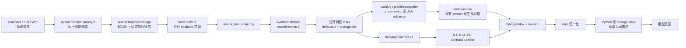
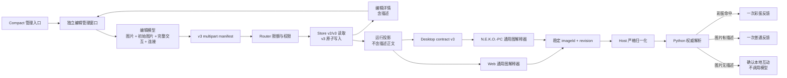
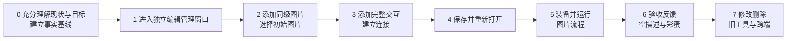
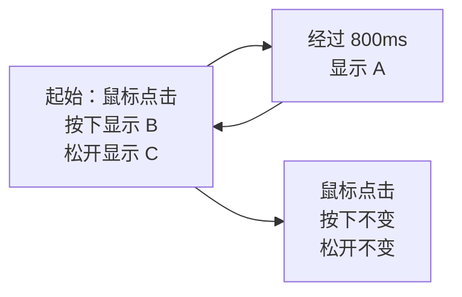

# Avatar 用户自定义通用道具实施与分阶段验收

> 状态：阶段 1 已收口，阶段 2 待实施  
> 编写日期：2026-09-02  
> 产品语义基线：[Avatar 用户自定义道具图片交互功能设计](./avatar-tool-user-created-general-design.md)（已锁定）  
> 代码事实基线：`/Users/tonnodoubt/N.E.K.O` 与 `/Users/tonnodoubt/N.E.K.O.-PC` 当前工作区  
> 本文只安排如何实现和验收，不重新解释或改写锁定设计。

## 1. 实施目标与完成条件

本轮要把现有“默认图片 + `press-swap` / `click-advance` 固定模式”替换为真正通用的用户图片交互图，同时继续使用已有的本地文件选择、保存、装备、输入判断、音效、彩蛋、模型反馈、跨端投影和生命周期链。

只有同时满足以下条件才算实施完成：

1. 用户从 Compact 的现有道具管理入口可以进入足够大的独立编辑工作区，并能原路返回；
2. 用户可以管理同级图片、选择唯一初始图片、填写可选互动描述；
3. 用户可以创建完整的“鼠标点击”与“经过一段时间”交互，并连接出顺序、自连接、回连和不同触发分支；
4. 保存、重新打开、修改、冲突处理、删除和装备闭环完整；
5. Web、Full、Compact 与 N.E.K.O.-PC 对同一配置执行相同的点击、延时、竞争、取消和重置语义；
6. 正常点击只按按下前的图片决定普通反馈；空描述不调用模型；彩蛋命中只产生一次彩蛋反馈；
7. 旧 v2 自定义道具继续可用，并且只在用户明确编辑保存时转换为新结构；
8. 阶段 0 的现状与目标基线通过，并按本文阶段 1～7 完成人工验收和留证；
9. 所有自动化检查通过。

阶段 0 是开始实施前的强制理解与基线门；阶段 1～7 按用户实际使用顺序设置验收门。它们都不是允许单独发布的半成品版本。跨仓库代码仍必须按“消费者先兼容、生产者后输出”的顺序落地，全部阶段通过后才能发布。

## 2. 当前实际功能架构

### 2.1 当前运行链



当前事实与目标之间有四个结构性差异：

| 当前实现 | 目标实现需要 |
|---|---|
| 创建和修改仍嵌在受 Compact 几何约束的管理弹窗中 | Compact 保留入口，但连线编辑进入不受小弹窗限制的扩展工作区 |
| `recordVersion: 2` 只接受默认图、必填变化图描述和两种固定模式 | 版本化的新记录保存同级图片、初始图片、完整交互和连接 |
| Web/PC 解释器根据 `imageChange.kind` 和图片序号运行 | Web/PC 使用同一份图片交互图解释器和稳定 ID |
| 点击提交 `changeIndex`，Python 读取变化后的图片描述 | 点击提交按下前记录的稳定 `imageId`，Python 用权威记录决定彩蛋、普通反馈或不调用模型 |

### 2.2 必须复用的现有边界

以下能力已经存在且经过大量测试，实施时只能扩展，不能另起一套：

- `AvatarToolItemManager.tsx` 的管理入口、返回、目录刷新、编辑冲突提示和焦点管理；
- `AvatarToolCreatePage.tsx` 里的本地 PNG/MP3 选择、桌面 Host 文件选择、字段错误、音效、彩蛋、保存和删除流程；
- `avatar_tool_router.py` 的 loopback 权限、CSRF、上传限额和所有 `UploadFile` 关闭路径；
- `avatar_tool_store.py` 的严格记录校验、资源摘要、目录闭包、原子创建/更新、备份恢复、隔离和总占用限制；
- Web `runtime.ts` 已有的命中区域、同一指针/按钮、移动取消、最新边界、UI 排除、generation、锁和 surface ownership；
- N.E.K.O.-PC 的 contract、runtime、interaction output 与 surface lifecycle；
- Host 与 Python 的载荷白名单、修订校验、去重、冷却和反馈调度。

## 3. 目标功能架构



架构上保持一份权威记录、一个输入事实链和一个模型反馈入口。编辑器、Web runtime 与 PC runtime 都消费同一语义模型；各端只承担自己已有的展示和生命周期职责。

## 4. 编辑工作区实施决定

### 4.1 形态

采用“独立编辑管理页 + 复用现有编辑组件和数据链”。创建/修改不再塞在 `avatar-tool-manager-dialog` 内，也不改造承载 Compact 的透明特殊窗口；桌面端按现有模型/角色管理页的做法，由同源路由 `/avatar_tool_editor` 打开一个普通、不透明、可移动和可缩放的管理窗口。

具体行为：

- 用户仍在 Compact、Full 或 Web 的“管理道具”里点击创建或修改；
- Electron 桌面端使用命名窗口复用同一个编辑管理页，已有窗口存在时切换到新目标并聚焦，不重复堆叠窗口；
- 编辑窗口复用项目现有同源子窗口 preload、`window_controls`、居中边界和管理窗口分类，使用正常窗口拖动、最小化、最大化、关闭与原生边缘缩放；
- Compact 只保留入口和目录展示，不改变自身 bounds、最小尺寸、透明穿透、setShape 或 surface 生命周期；
- Web 场景复用同一编辑组件，在当前可用视口内显示，不建立另一套编辑逻辑；
- 保存或删除成功后通过已有目录刷新事件同步管理列表；关闭或返回只结束编辑页，不需要恢复 Compact 几何；
- 编辑页继续使用现有 API、目录状态和 mutation security，不形成第二份缓存、保存链或运行链。

### 4.2 工作区组成

工作区采用稳定的四区结构，不在 Compact 小面板里缩小节点：

1. 顶部命令区：返回、道具名称、保存状态、保存；
2. 图片与反馈资源区：同级图片、初始图片选择、可选描述、普通音效和彩蛋；
3. 中央视图画布：只显示完整的鼠标点击/延时交互及它们之间的连接；
4. 选中项设置区：修改所选完整交互的触发参数和图片动作。

画布使用 `@xyflow/react`，实施时新增并锁定依赖版本。项目当前是 React 18，尚未安装节点编辑库；选用它是为了直接获得成熟的平移、缩放、适配视图、小地图、边连接和键盘可达能力，而不是把通用状态机语义引入产品。小地图在图超出视口时显示并可折叠；触控板、鼠标与键盘都必须能完成导航和删除。

参考只用于验证编辑器可用性：

- React Flow 的[视口交互](https://reactflow.dev/learn/concepts/the-viewport)、[内置 Controls / MiniMap](https://reactflow.dev/learn/concepts/built-in-components)和[键盘与无障碍支持](https://reactflow.dev/learn/advanced-use/accessibility)；
- Stately 的[画布、连接和选中项详情面板](https://stately.ai/docs/design-mode)以及[不可达状态提示](https://stately.ai/docs/editor-states-and-transitions)；
- Rive 的[Graph、States、Transitions 分工](https://rive.app/docs/editor/state-machine/state-machine)。

本项目不照搬这些产品的开始节点、父子状态、guard、代码面板或原始事件。锁定设计里的“无开始节点、完整交互整体连接、简单闭环校验”优先。

## 5. 数据、API 与运行契约

### 5.1 v3 权威记录

新保存记录使用 `recordVersion: 3`。以下结构表达字段职责；实施时由前后端共享的测试样例锁定精确字段名和严格键集合。

```json
{
  "recordVersion": 3,
  "id": "local-<uuid>",
  "name": "道具名称",
  "images": [
    {
      "id": "img-<stable-id>",
      "resource": "image-001.png",
      "meaning": "允许为空"
    }
  ],
  "initialImageId": "img-<stable-id>",
  "imageInteractions": {
    "entryIds": ["ix-<stable-id>"],
    "items": [
      {
        "id": "ix-click",
        "trigger": { "kind": "mouse-click" },
        "actions": {
          "press": { "kind": "keep" },
          "release": { "kind": "show", "imageId": "img-b" }
        },
        "editorPosition": { "x": 240, "y": 160 }
      },
      {
        "id": "ix-delay",
        "trigger": { "kind": "after", "delayMs": 800 },
        "actions": {
          "complete": { "kind": "show", "imageId": "img-a" }
        },
        "editorPosition": { "x": 560, "y": 160 }
      }
    ],
    "links": [
      { "from": "ix-click", "to": "ix-delay" },
      { "from": "ix-delay", "to": "ix-click" }
    ]
  },
  "interaction": {
    "normalSound": "normal.mp3",
    "special": {
      "probability": 0.1,
      "image": "special.png",
      "meaning": "彩蛋描述",
      "sound": "special.mp3"
    }
  },
  "resourceDigests": {
    "image-001.png": "<sha256>"
  }
}
```

关键约束：

- 图片 ID、交互 ID 在一次创建后稳定；重排画布、替换文件或改描述不得改变 ID；
- `keep` 是存储层对用户“图片不变”的明确表达，不新增第三种用户动作；
- 编辑坐标只影响重新打开时的布局，不参与运行判断；
- 描述始终为字符串，空字符串合法；运行投影只暴露 `hasMeaning`，不暴露描述正文；
- 彩蛋图片继续是现有彩蛋效果资源，不混入可显示、连接的普通图片项；
- 图片、交互、连接和延时上限由后端 `limits` 统一下发，前端不得另写一套数值；
- 资源摘要和目录闭包必须覆盖普通图片、普通音效和彩蛋资源；
- revision 前缀由记录版本产生，v3 为 `3-<digest integer>`，不能继续硬编码 `2-`。

### 5.2 创建与更新 API

现有平行数组字段容易在增加稳定 ID、已有资源和新上传后错位。v3 改为一个 JSON manifest 加重复文件字段：

- manifest 保存名称、图片 ID、描述、初始图片、交互、连接及每个媒体的来源引用；
- 新文件使用 `{ "kind": "upload", "index": n }` 指向重复上传字段；
- 更新时保留的文件使用 `{ "kind": "resource", "name": "..." }`；
- 每个上传必须被引用一次，每个资源名必须属于当前记录，不能出现重复引用、未使用上传或跨道具资源；
- Router 继续先做 mutation security，再限量读取并在所有成功/失败路径关闭上传；
- Store 在临时目录内验证 manifest、媒体、摘要和目录闭包后，继续用现有原子发布/回滚流程。

GET 列表返回可运行的 v2/v3 联合 DTO；GET detail 返回可编辑结构。只有 detail 包含描述正文。保存成功仍返回管理页且不自动装备。

### 5.3 Web 与 Desktop 运行投影

内置固定道具保持 definition v1；旧自定义道具保持 definition v2；新结构使用 definition v3，避免改变已有 profile 的含义。

v3 本地 profile 使用独立的 `custom-graph` 分支，至少包含：

- authoritative revision；
- 图片 ID 到 frame index / URL / `hasMeaning` 的只读映射；
- `initialImageId`；
- entry IDs、完整交互和 links；
- 现有 burst、touch zone、普通音效和彩蛋定义。

Web 的 `catalog.ts`、`desktopContract.ts` 与 PC 的 `contract.js` 对同一份 v3 fixture 做严格解析。v1/v2 分支不改语义，v3 只允许本地 UUID 道具。

### 5.4 图运行状态

每个已装备道具的运行状态只有：

```text
当前图片 ID
当前等待位置中的候选完整交互 ID 集合
候选延时的进入时间与到期时间
可选的进行中点击票据
现有 generation / surface ownership / disposer
```

进入 entry 或某交互的后继位置时，建立候选集并为延时候选登记到期时间：

- 最先正常完成的候选成为唯一胜者，取消同级候选；
- 点击按下前先记录当前图片 ID，再执行按下图片动作；
- 点击按下后暂时占有该等待位置，同级延时到期只能记为待处理，不能插入按下与松开之间；
- 正常松开时执行松开动作、提交记录图片结果、前进到后继位置；
- 点击取消、移出或失焦时不执行配置的松开动作，而是恢复按下前图片且不前进，然后恢复原候选集；已经到期的延时随后立即按原到期顺序竞争；
- 延时胜出时执行目标图片动作并前进；
- 无后继时停止等待并保持当前图片；
- 工具切换、revision 变化、surface handoff、失去 ownership 或销毁时，由现有 disposer/generation 取消旧票据和计时器并恢复新周期的初始图片；
- 不能建立独立的 document pointer 监听器或 PC surface 生命周期。

### 5.5 点击反馈载荷

v2 继续使用 `changeIndex`。v3 使用稳定 `imageId`，两者在同一载荷中互斥：

```text
toolId + toolRevision + imageId + touchZone + intensity + specialTriggered?
```

正常点击的处理顺序固定为：

1. runtime 使用按下前记录的图片 ID，不使用按下/松开动作后的图片；
2. 正常点击照常执行本地音效、彩蛋抽样和图片动作；
3. 彩蛋命中时提交一次彩蛋事实；
4. 彩蛋未命中且运行投影的 `hasMeaning` 为 true 时，提交一次普通事实；
5. 彩蛋未命中且 `hasMeaning` 为 false 时，不发送模型反馈事件，不占用互动冷却；
6. Python 仍以 tool revision 和权威记录复核 image ID、彩蛋配置和真实描述；即使客户端被篡改，空描述也不得进入提示词或模型；
7. 无效点击、取消或旧 generation 不提交事实，也不推进图。

Host 的 camelCase/snake_case 白名单、WebSocket 事实和 Python normalizer 同步增加 `imageId` / `image_id`，并继续拒绝未知字段。

### 5.6 v2 兼容与转换

- 列表、装备和运行继续读取 v2，不能在扫描、启动或 GET 时静默改文件；
- 用户打开 v2 编辑时，前端显示等价的新编辑模型；只有保存成功才由 Store 写成 v3；
- `press-swap` 转为一个自连接点击：按下显示旧变化图，松开显示旧默认图；
- `click-advance` 转为点击链：每项松开显示下一张旧变化图，最后一项自连接并保持最后一张；
- 旧默认图成为同级初始图片，描述为空；旧变化图描述、音效和彩蛋全部保留；
- 转换只保证旧视觉过程可表达；点击反馈改按按下前图片取描述是锁定设计要求，不宣称旧反馈无损；
- base revision 冲突仍返回最新 detail，不能覆盖另一窗口的新版本。

## 6. 阶段 0 与按用户步骤划分的七个实施阶段



阶段 0 用只读调查、当前功能实测和基线测试证明已经理解充分；阶段 1～7 必须用真实 UI 完成人工路径，不能用接口调用或测试代码代替。验收证据使用核对表、命令结果、截图、短录屏或聊天记录；不为此增加正式产品里的“预览”功能。

### 阶段 0：充分理解当前情况与目标

**目的**

在修改功能代码或安装依赖前，确认当前起点、目标边界、主要代码落点和实施阻断。阶段 0 只回答“能否安全开始实施”，不提前重做阶段 1～7 的用户验收。

**执行边界**

- 只读取文档、代码、配置、测试和本地非敏感运行状态；
- 可以运行与本功能直接相关的现有测试和必要的当前界面抽查；
- 不修改功能代码、数据结构、依赖、用户已有本地道具或锁定设计；
- 不把历史助手结论、旧文档描述或外部方案当作当前代码事实；
- 发现锁定设计与当前事实之间存在未被实施文档处理的业务分歧时，停止进入阶段 1，提交给用户确认，不自行修改锁定设计。

#### 0.1 确认目标和现状

完整读取锁定设计和本实施文档，并核对当前实际代码。记录以下事实即可：

- 两仓库分支、版本、工作区已有内容和本功能依赖；
- 当前管理、创建、API、Store、Web 运行、Desktop 投影、PC 运行、Host/Python 反馈的主链；
- 当前 v2 与锁定目标之间的结构差异；
- 阶段 1～7 各自负责实现和人工验收什么。

只需建立到模块和阶段的映射，不要求在阶段 0 为每个字段制作截图、fixture 和独立用例。

#### 0.2 建立最小基线

运行能够证明现有道具链未在实施前损坏的最小检查：

```text
N.E.K.O 前端类型检查 + 本功能相关测试
N.E.K.O Python Store / Router / 反馈契约测试
N.E.K.O.-PC 本功能相关 contract / runtime / lifecycle 测试
```

已有的整仓检查结果可以引用，但不为阶段 0 强制重复跑全量测试、构建、Electron smoke 或所有平台组合。失败只需区分为“本功能阻断”“实施前无关失败”或“当前环境不可运行”；阶段 0 不顺手修复。

阶段 0 不再要求创建两个临时道具、制造 revision 冲突、逐个 surface 重放完整闭环或为当前旧界面录制全套证据。这些行为已有代码和测试可确认的，以代码和测试为准；真正的用户路径留在阶段 1～7 验收。

#### 0.3 验证关键技术路径

在不安装依赖、不写代码的前提下确认：

- 当前 Electron/React 宿主能否按已有模型/角色管理页模式打开同源独立管理窗口，同时不改变 Compact 的特殊窗口状态；
- 独立编辑页是否能继续使用现有目录状态、mutation security、Host 文件选择和同源刷新机制；
- `@xyflow/react` 与当前 React/TypeScript/Vite 版本、许可、CSP 和打包目标是否兼容，并记录拟锁定版本；
- definition v3 与现有 wireVersion、v1/v2 strict decoder 如何并存；
- v3 `imageId` 能否沿 Web、desktop contract、PC output、Host 和 Python 全链到达且不暴露描述正文；
- timer/ticket 怎样进入现有 disposer、generation 和 surface ownership，而不是形成第二套生命周期；
- v2 转换样例能否精确生成本文规定的新图，并保持资源闭包和 revision 冲突语义。

这里确认是否存在结构性阻断，不要求在阶段 0 写出 v3 decoder、图解释器或跨端实现原型。外部节点编辑器资料只能支持兼容性判断，不能改变锁定设计。

#### 0.4 阶段 0 交付物

阶段 0 只保存一份简短基线记录，不额外制造重复设计文档。记录包含：

1. 两仓库工作区状态与本功能相关版本/依赖；
2. 当前主链、目标差异和阶段 1～7 的落点；
3. 已运行的相关检查及实施前失败分类；
4. 关键技术路径是否可行；
5. 是否存在进入阶段 1 的阻断。

**阶段 0 人工验收门**

- [x] 当前主链、目标差异和必须复用的边界已经明确；
- [x] 本功能相关基线没有未分类失败；
- [x] 目标方案没有已知结构性技术阻断；
- [x] 两仓库已有用户内容已识别并会保留；
- [x] 没有未确认的业务问题。

**通过条件**：上述五项通过即可进入阶段 1。具体界面、运行结果和跨端一致性按阶段 1～7 的人工验收逐步证明，不在阶段 0 重复验收未来功能。

### 阶段 1：从 Compact 进入独立编辑管理窗口

**用户路径**

```text
Compact → 管理道具 → 创建自定义道具 / 修改已有道具 → 独立编辑管理窗口
```

**实施内容**

- 将 `AvatarToolItemManager` 的 `create/edit` 内容从当前小弹窗中拆出；
- 新增 `/avatar_tool_editor` 同源管理页和命名窗口打开/复用逻辑，编辑内容继续复用同一套 React 组件；
- 按模型/角色管理页的现有窗口链接入 child preload、标题栏控制、正常拖动、原生缩放、最小尺寸和显示时机；
- Compact 不扩窗、不切换 `resizable`、不增加自定义缩放 IPC，也不改变透明区域和鼠标穿透契约；
- 保留管理器 session guard、目录刷新、编辑冲突处理和现有 Web 回退；
- 接入画布 viewport、Controls、按需 MiniMap 和中文无障碍文案；
- 编辑窗口是独立的不透明交互面，不依赖 Compact 的模型拖动、点击穿透或 setShape 采集。

**人工验收**

- [x] 在 Compact 点击“创建”或“修改”后打开独立编辑管理窗口，不改变 Compact 的位置、尺寸、穿透和可缩放状态；
- [x] 编辑窗口可通过标题栏移动，可从系统窗口边缘缩放，并能最小化、最大化和关闭；
- [x] 图片区、画布和设置区文字、按钮无需缩到难以阅读；真实连接点随阶段 3 产生后继续验收；
- [x] 画布可点击、平移、缩放、适配视图；节点和连接的键盘焦点契约已用示例节点验证，真实流程随阶段 3 继续验收；
- [x] 保存/删除后原管理列表刷新；关闭或返回后 Compact 仍保持原状态；
- [x] 从 Full/Web 进入时复用同一编辑组件、接口和数据模型，不出现第二套业务实现。

**留证（2026-09-02 收口）**：

- `.agent/evidence/avatar-tool-stage1-2026-09-02/compact-entry.png`；
- `.agent/evidence/avatar-tool-stage1-2026-09-02/editor-full.png`；
- `.agent/evidence/avatar-tool-stage1-2026-09-02/open-move-resize-close.mov`。

**阶段 1 实施记录（2026-09-02）**

- 状态：阶段 1 的代码实现、真实桌面/Web 验收与留证均已完成，阶段 1 已收口；
- 纠错：此前把“复用同一编辑能力”错误实现为临时扩展 Compact 特殊窗口，引出了穿透、setShape、拖动、缩放、最小尺寸和退出恢复等本不应由编辑器承担的问题。此前基于该承载方式的截图、录屏、勾选项和“实现完成”结论全部作废；
- 当前结构：`AvatarToolItemManager` 只负责入口和目录；Electron 的创建/修改打开 `/avatar_tool_editor` 命名管理窗口，编辑页复用 `AvatarToolEditorWorkspace`、`AvatarToolCreatePage`、现有 catalog/API 和 mutation security；Web 继续复用相同组件；
- 窗口链：编辑页沿用现有同源 child preload 与 `window_controls`，PC 把该路由归入普通管理窗口，采用不透明、可移动、可缩放、有最小化/最大化/关闭能力的窗口；Compact 的 bounds、resizable、透明输入区域和生命周期不再参与；
- 已撤销：此前为 Compact 编辑 workspace 增加的最小尺寸覆盖、bounds 扩展/恢复、八向缩放坐标桥接、强制关闭穿透和额外几何采集均已移除，对应错误测试也已删除；
- 当前功能：左侧为 React Flow 画布，右侧为当前道具设置；已有平移、缩放、适配视图、键盘焦点、中文无障碍标签以及节点达到 4 个时出现的 MiniMap。当前旧 `definitionVersion: 2` 表单只作为阶段 1 的设置内容继续工作，图片同级化和真实交互节点从阶段 2、3 实施；
- Web 收口修正：共享的 `/chat`、`/chat_full` 模板在 Web 也静态带有 `electron-chat-window`，不能用它识别 Electron。现改为只认 `__LANLAN_IS_ELECTRON_PET__` 或模板注入的 `neko-electron-runtime`；实际 Web 创建入口已恢复为同页编辑 workspace，桌面仍打开独立窗口，并增加对应回归测试；
- 自动验证：前端 TypeScript 类型检查和生产构建通过；全量 `19` 个测试文件、`522` 个测试通过；N.E.K.O.-PC 的窗口契约定向测试 `55` 项通过、`1` 项按环境跳过，无失败；此前 N.E.K.O 相关静态/路由资源 `111` 项和 N.E.K.O.-PC 组合测试 `199` 项通过、`35` 项按非当前平台跳过的基线继续成立；
- 实际桌面验证：完整重启后从 Compact 依次打开“头像道具 → 管理道具 → 创建道具”，得到居中的 `1280 × 900` 独立编辑窗口。打开、保存、修改、删除和关闭编辑窗口期间，Compact 管理状态保持 `950 × 1041`、位置 `(-1779, 30)` 不变；编辑窗口实测可移动、缩放为 `1100 × 760` 后恢复 `1280 × 900`、最大化/恢复、最小化/恢复和关闭；默认尺寸及缩至 `1280 × 820` 时保存按钮均完整可见；
- 数据闭环验证：通过独立编辑窗口真实创建临时道具，保存后原管理列表和 `/api/avatar-tools` 目录同步出现；再从管理列表打开修改窗口并删除，原列表立即移除且目录恢复为空，临时数据已清理；
- Full/Web 验证：桌面 Full 从相同管理器打开同一个 `/avatar_tool_editor`，再次点击创建只复用同一命名窗口；Web `/chat` 实际进入同页 `AvatarToolEditorWorkspace`，Compact、Full 和 Web 均复用同一 catalog/API 与数据模型；
- 画布验证：实际桌面页中的缩放控制把视图 `1.0 → 1.2`，滚轮平移改变画布位移，适配视图按钮可操作；React Flow 的示例节点/连接测试覆盖键盘焦点、中文 Controls 文案和按需 MiniMap。真实图片节点和连接点仍按阶段 2、3 的用户路径实施，不反向复杂化阶段 1；
- 收口结论：六项阶段 1 人工验收均已通过，当前没有进入阶段 2 的阻断。

### 阶段 2：添加同级图片并选择初始图片

**用户路径**

```text
填写名称 → 添加图片 A/B/C → 选 A 为初始图片 → 分别填写或留空互动描述
```

**实施内容**

- 建立稳定 image ID 的编辑状态；
- 复用现有本地 PNG/桌面 Host 选择、大小与像素错误；
- 去掉“默认图/变化图”和两种模式的 UI；
- 每张图片提供初始图片单选与可选描述；
- 图片被动作引用时，删除入口明确指出引用位置并阻止产生悬空引用；
- 图片错误按稳定 ID 定位，不再依赖变化图片数组序号。

**人工验收**

- [ ] 添加三张外观可明显区分的 PNG，三张在 UI 中地位相同；
- [ ] 任意图片都能被改为唯一初始图片；
- [ ] A 填写“这是 A”，B 描述留空，C 填写“这是 C”，均可继续编辑；
- [ ] 替换图片文件后 image ID 与所有引用不变；
- [ ] 尝试删除已被交互引用的图片时被阻止，并能看出需要修改哪个交互；
- [ ] 删除当前初始图片前必须先选择另一张；单选控制不会产生两个初始图片。

**留证**：图片区截图，需同时看到三张同级图片、唯一初始标记和一个空描述。

### 阶段 3：添加完整交互并建立连接

**用户路径**

```text
添加鼠标点击 → 设置按下/松开图片动作 → 添加延时 → 连接 → 标记起始交互
```

**实施内容**

- 节点库只提供“鼠标点击”和“经过一段时间”；
- 鼠标点击节点内部固定显示“按下时 / 松开时”，两项都可选图片不变；
- 延时节点只设置正数等待时间和目标图片；
- 连接 handle 属于完整节点，不出现在按下/松开内部动作上；
- entry 使用节点标记或清单，不绘制开始节点；
- 保存校验覆盖引用、可达性、重复边和同一等待位置的触发歧义；同一候选集最多一个鼠标点击，相同等待时长的延时视为无法区分，循环合法；
- 字段或连接错误同时在节点、设置区和保存错误摘要中定位。

**标准验收图**



这张图表示：第一次点击后同时等待延时回到循环或再次点击退出；`I3` 没有后继，因此退出时保持当时图片。

**人工验收**

- [ ] 画布可以建立上图，点击节点始终作为整体移动、复制、连接和删除；
- [ ] 页面中不存在“有效点击”“点击成立阶段”“释放事务”或 pointerdown/pointerup；
- [ ] 按下和松开都选择“图片不变”的 `I3` 可以保存；
- [ ] `I2 → I1` 回连合法，节点不需要结束节点；
- [ ] 两个无法区分的点击放在同一等待位置时保存失败并准确标出；
- [ ] 未被任何起始交互到达的正式节点保存失败，自连接和完整循环不报终止性错误。

**留证**：一张完整画布截图，连接、起始标记和 `I1/I2/I3` 设置可辨认。

### 阶段 4：保存并重新打开

**用户路径**

```text
完成配置 → 保存 → 返回管理页 → 再次修改同一道具
```

**实施内容**

- 完成 v3 manifest、Router、Store 校验与 v2/v3 DTO；
- 保存节点位置、图片稳定 ID、entry、links、音效和彩蛋；
- 继续使用原子发布、resource digest、目录闭包、总占用和 base revision；
- 保存失败保留编辑内容并聚焦首个实际错误；
- 保存成功刷新目录并返回管理页，不自动装备。

**人工验收**

- [ ] 保存标准验收图后只出现一个新道具卡片且未自动装备；
- [ ] 再次打开时图片、描述、初始图片、节点位置、连接、音效和彩蛋与保存前一致；
- [ ] 故意制造空名称、无 entry、非法延时、悬空引用和不可达节点，分别得到可定位错误且页面内容不丢失；
- [ ] 两个窗口同时修改时，后保存的一方不能覆盖前者，会载入最新版本并提示冲突；
- [ ] 对应的原子更新与恢复自动化用例通过，证明中断写入不会破坏旧正式记录。

**留证**：保存前与重新打开后的同构截图、一次字段错误截图、一次 revision 冲突截图。

### 阶段 5：装备并运行图片流程

**用户路径**

```text
管理页选择道具 → 保存装备槽 → 点击 Avatar 或等待 → 查看图片按图运行
```

**实施内容**

- Web 和 PC 增加 v3 `custom-graph` 严格解码；
- 在已有 Web/PC pointer session 中接入图解释器，不增加全局监听；
- 使用稳定 image ID 驱动 frame，进入新周期显示初始图片；
- 所有延时进入现有 disposer/generation 生命周期；
- 实现候选竞争、点击占有、取消恢复、终点保持和循环；
- surface handoff、revision 变化和重装备清理旧计时器与旧点击票据。

**人工验收**

- [ ] 装备阶段 3 的标准图后首先显示 A；
- [ ] 正常点击时按下立即显示 B，松开显示 C；
- [ ] 松开后等待 800ms 会显示 A 并回到起始点击；
- [ ] 在 800ms 内开始 `I3` 点击，即使松开晚于 800ms，延时也不能插入按下与松开之间；完成后保持 C；
- [ ] `I3` 按下后移出、取消或失焦不会前进；对带按下换图的 `I1` 做同样操作会恢复按下前图片；恢复后延时仍按原进入时间处理；
- [ ] 快速重复 pointerup、不同 pointerId、拖动、UI 排除区和旧 generation 都不能重复提交；
- [ ] 卸载、换道具、修改当前道具或切换 owning surface 后没有旧计时器突然换图。

**留证**：一段完整录屏，包含点击 B→C、延时 C→A、点击抢先退出并保持 C。

### 阶段 6：按按下前图片产生反馈

**用户路径**

```text
点击 Avatar → 本地图片动作完成 → 有适用描述才收到一次反馈
```

**实施内容**

- v3 commit 和 desktop output 使用 `imageId`，不从变化后 frame 推导 `changeIndex`；
- Host、Python normalizer 和 `GreetingMixin` 按 recordVersion 严格选择 v2/v3 事实；
- 点击按下时先冻结图片 ID，再执行按下动作；
- `hasMeaning=false` 且彩蛋未命中时在客户端不发送模型反馈事件；服务端再做权威兜底；
- 彩蛋命中替代普通反馈，本地图片动作仍完成；
- 普通音效、彩蛋音效/散落效果继续沿用现有执行器。

**人工验收**

- [ ] A 描述为“只回答：A”，点击配置为按下 B、松开 C；第一次回复只能是 A，不能是 B 或 C；
- [ ] 当前图片为描述为空的 B 时正常点击，本地切图和音效照常，但没有思考状态、回复或模型请求；
- [ ] 当前图片为有描述的 C 时，按下和松开都不变，仍只产生一次 C 回复；
- [ ] 彩蛋概率设为 100% 后只出现一次彩蛋反馈，不再同时出现 A/C 普通反馈；
- [ ] 无效点击、取消和被旧 revision 拒绝的点击没有回复且不推进图；
- [ ] Web 与 PC 产生的 v3 载荷都含相同的冻结 image ID，未知或跨道具 image ID 被服务端拒绝。

**留证**：包含 A 回复、B 无回复、C 回复和 100% 彩蛋四段结果的聊天记录或录屏。

### 阶段 7：修改、删除、旧工具和跨端闭环

**用户路径**

```text
重新修改 / 删除 → 重启或切换 Web、Full、Compact、PC → 继续使用
```

**实施内容**

- 完成 v2 编辑转换、v2 未编辑直读和 v3 更新；
- 检查目录刷新、装备槽清理、删除当前工具与跨窗口冲突；
- 对 Web/Full/Compact/PC 做同配置对照；
- 保留 PC 的 surface lease/generation、截图暂停、失焦、隐藏和 teardown 规则；
- 更新正式的当前实现维护文档和提示词指南，使其在代码实际落地后描述 v3，而不是提前声称已实现。

**人工验收矩阵**

| 场景 | Web | Full | Compact | N.E.K.O.-PC |
|---|---:|---:|---:|---:|
| 初始图片一致 | [ ] | [ ] | [ ] | [ ] |
| 点击按下/松开图片一致 | [ ] | [ ] | [ ] | [ ] |
| 延时、回连和退出一致 | [ ] | [ ] | [ ] | [ ] |
| 空描述不调用模型 | [ ] | [ ] | [ ] | [ ] |
| 彩蛋只替代一次反馈 | [ ] | [ ] | [ ] | [ ] |
| 切端/失焦/重启无旧计时器 | [ ] | [ ] | [ ] | [ ] |

补充检查：

- [ ] 未编辑的旧 `press-swap` 和 `click-advance` 道具继续按 v2 运行；
- [ ] 打开旧工具能看到转换后的新图，取消不改磁盘，保存后变为 v3；
- [ ] 转换后旧图片、描述、音效和彩蛋资源无丢失；
- [ ] 修改已装备道具后使用新 revision 和新图重新开始；
- [ ] 删除已装备道具后装备槽与各 surface 同步清理；
- [ ] 重启应用后目录、节点布局和运行初始状态正确。

**留证**：完成的矩阵、一个旧工具转换录屏、一个跨 surface 切换录屏。

## 7. 代码落点与测试范围

### 7.1 N.E.K.O

| 职责 | 当前主要文件 | 实施方向 |
|---|---|---|
| 管理入口/编辑工作区 | `AvatarToolItemManager.tsx`、`AvatarToolStandaloneEditor.tsx`、`AvatarToolEditorWorkspace.tsx`、`AvatarToolCreatePage.tsx`、`templates/avatar_tool_editor.html`、`styles.css` | 管理弹窗只保留入口；桌面端打开独立同源管理页；拆出 workspace、图片区、画布与 inspector；复用媒体和反馈表单 |
| 客户端 DTO/API | `avatar-tools/localTools.ts` | v2/v3 联合解码、manifest 上传、v3 runtime definition |
| 定义与解释器 | `catalog.ts`、`profileInterpreter.ts`、`interaction.ts` | 增加 definition v3 / `custom-graph`，v1/v2 不变 |
| Web runtime | `runtime.ts` | 在现有 session 中加入图状态、延时与冻结 image ID |
| Web/PC 投影 | `protocol.ts`、`desktopContract.ts` | v3 payload 与 desktop contract，v2 `changeIndex` 保留 |
| API 与存储 | `main_routers/avatar_tool_router.py`、`utils/avatar_tool_store.py` | v3 manifest、严格校验、v2 读取/转换、原子资源闭包 |
| Host 与模型入口 | `static/app/app-buttons.js`、`config/prompts/avatar_interaction_contract.py`、`main_logic/core/greeting.py` | `imageId/image_id` 白名单、revision 分流、空描述抑制和彩蛋替代 |

新增 UI 文件按现有目录组织，建议至少拆分 `AvatarToolEditorWorkspace`、`AvatarToolImagePanel`、`AvatarToolInteractionCanvas`、`AvatarToolInteractionInspector` 和纯函数 `avatarToolEditorModel`；不要继续扩大单个 `AvatarToolCreatePage.tsx`。

重点自动化用例：

- `AvatarToolItemManager.test.tsx`：入口、workspace、返回、焦点、冲突；
- `localTools.test.ts`：v2/v3 DTO、manifest、stable IDs、转换；
- 新编辑模型测试：引用、可达、歧义、循环和错误定位；
- `catalog.test.ts`、`desktopContract.test.ts`：严格 v3 契约与恶意字段；
- `runtime.test.tsx`、`interaction.test.ts`：按下/松开、延时竞争、取消、generation、冻结 image ID；
- `protocol.test.ts`：v2 `changeIndex` 与 v3 `imageId` 互斥；
- `test_avatar_tool_store.py`、`test_avatar_tool_router.py`：v3 记录、上传映射、资源闭包、原子恢复和 v2 转换；
- `test_avatar_interaction_payload_contract.py`、`test_local_avatar_tool_interaction.py`：权威 image ID、空描述、彩蛋和 revision。

建议验证命令：

```bash
cd /Users/tonnodoubt/N.E.K.O/frontend/react-neko-chat
npm run typecheck
npm test
npm run build

cd /Users/tonnodoubt/N.E.K.O
uv run pytest tests/unit/test_avatar_tool_store.py tests/unit/test_avatar_tool_router.py tests/unit/test_avatar_interaction_payload_contract.py tests/unit/test_local_avatar_tool_interaction.py
```

### 7.2 N.E.K.O.-PC

| 职责 | 当前主要文件 | 实施方向 |
|---|---|---|
| 严格契约 | `src/desktop-avatar-tools/contract.js` | 在保留 v1/v2 的同时接受本地 definition v3 / `custom-graph` |
| 图运行 | `src/desktop-avatar-tools/runtime.js` | 复用现有 interaction engine、generation 和 scheduler 实现相同图语义 |
| 反馈输出 | `src/desktop-avatar-tools/interaction-output.js` | v3 输出冻结 `imageId`，v2 继续输出 `changeIndex` |
| 生命周期 | `src/desktop-avatar-tools/surface-lifecycle.js` | 把图 timer/ticket 纳入现有 ownership 清理，不建第二套 lifecycle |
| 编辑管理窗口 | `src/window-manager.js`、`src/main/pet-window-lifecycle.js` | 把 `/avatar_tool_editor` 纳入现有普通管理窗口分类；不改 Compact 特殊窗口契约 |

重点测试：

- `test/desktop-avatar-tool-contract.test.js`；
- `test/desktop-avatar-tool-runtime.test.js`；
- `test/desktop-avatar-tool-runtime-lifecycle.test.js`；
- `test/pet-avatar-tool-adapter.test.js`；
- `test/integration/avatar-tool-cross-repo.test.js`；
- `test/integration/neko-web-contract.test.js`。

建议验证命令：

```bash
cd /Users/tonnodoubt/N.E.K.O.-PC
npm run lint
npm run test:unit
npm run test:contract
npm run test:integration
```

## 8. 跨仓库落地顺序

同一次功能开发中按以下顺序合并代码能力，但不在中途开放产品入口：

1. 增加共享 v3 fixtures 和 v2/v3 兼容测试；
2. N.E.K.O.-PC 与 Web 先增加 v3 contract 解码和 runtime 消费能力，生产者仍只输出 v2；
3. Python Store/Router 增加 v3 读取、写入和 v2 显式保存转换；
4. Host/Python 反馈链先接受并验证 v3 `imageId`；
5. Web 目录开始构造 definition v3，完成 Web/PC 实际运行对照；
6. 最后开放独立编辑管理页中的创建/保存入口；
7. 阶段 0 与全部七个用户实施阶段通过后，才更新正式维护文档并进入发布验证。

这样旧 PC 不会先收到无法解析的新定义，新 UI 也不会先保存出无法运行或无法反馈的道具。

## 9. 最终检查清单

- [x] 阶段 0 已完成且所有当前事实、基线失败、用户既有修改和目标映射均有记录；
- [ ] 锁定设计中的用户术语没有被底层事件或状态机术语替换；
- [ ] Compact 是入口和回程，不是连线画布容器；
- [ ] 没有第二套 pointer、业务数据源、模型反馈或生命周期；独立编辑窗口只承载同一套编辑组件与数据链；
- [ ] v1 内置道具、v2 旧自定义道具和 v3 新自定义道具严格分流；
- [ ] 稳定 ID 贯穿编辑、存储、运行、Desktop 和 Python 权威解析；
- [ ] 描述正文只出现在编辑详情与 Python 权威记录，不进入公开目录/桌面契约；
- [ ] 空描述、彩蛋命中、取消点击、延时竞争和 surface handoff 都有自动化与人工证据；
- [ ] Store 的资源完整性、原子更新、恢复和隔离测试没有因新 schema 退化；
- [ ] 两个仓库的测试、类型检查/静态检查和构建全部通过；
- [ ] 正式设计/维护文档只在代码落地后更新为已实现状态。
