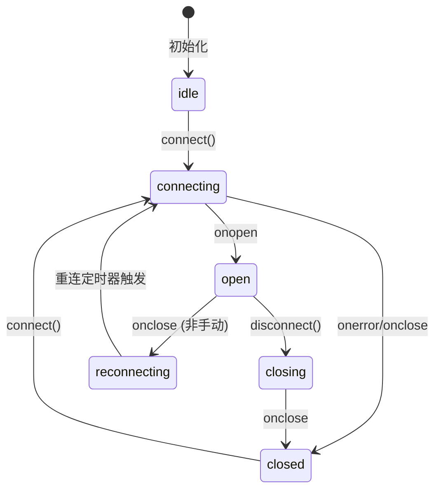

# Chat Text Conversation Feature Spec

> 创建于 2026-01-18，文档记录 ChatContainer 文本对话功能的设计与实现。

---

## 1. 背景（Background）

- **为什么要做**：N.E.K.O 项目需要支持文本对话功能，作为语音对话的补充，允许用户通过键入文字与 AI 助手交互。
- **现状问题**：
  - 之前 ChatContainer 仅支持独立模式，无法与后端 WebSocket 实时通信
  - 缺少连接状态显示，用户无法了解当前通信状态
  - 消息可能重复（内部状态和外部状态都添加用户消息）
- **约束**：
  - 需要兼容 Web (Vite) 环境
  - 需要与 `@project_neko/realtime` 包集成
  - UI 需要支持 i18n

---

## 2. 目标（Goals）

- **必须达成**：
  - ChatContainer 支持通过 WebSocket 发送和接收文本消息
  - 显示连接状态（已连接/连接中/已断开等）
  - 支持截图附件功能
  - 消息去重（外部模式下不重复添加用户消息）
  - 输入禁用状态支持

- **可选增强**：
  - 消息发送状态指示（发送中/已发送/失败）
  - 消息历史持久化
  - 打字指示器

## 3. 非目标（Non-goals）

- **明确不做**：
  - 消息编辑/删除功能
  - 消息反应（表情回复）
  - 富文本格式支持
  - 文件上传（非截图）

---

## 4. 范围与影响面（Scope）

- **涉及 packages**：
  - `@project_neko/components` - ChatContainer, ChatInput, MessageList
  - `@project_neko/realtime` - WebSocket 客户端

- **涉及宿主**：
  - Web (Vite) ✅
  - legacy HTML+JS (UMD) - 待验证
  - React Native (Expo/Metro) - 待同步

- **是否影响同步**：
  - 需要同步到 N.E.K.O.-RN（ChatContainer 接口变更）

---

## 5. 术语表（Glossary）

| 术语 | 定义 |
|------|------|
| **ChatContainer** | 聊天容器组件，包含消息列表和输入区域 |
| **externalMessages** | 来自父组件的消息（如 WebSocket 响应） |
| **internalMessages** | 组件内部管理的消息（独立模式） |
| **connectionStatus** | WebSocket 连接状态 |
| **PendingScreenshot** | 待发送的截图对象 |

---

## 6. 对外接口（Public API / Contract）

### 6.1 API（函数/类/事件）

- **入口文件**：
  - `@project_neko/components/src/chat/index.ts`

- **导出项**：
  ```typescript
  export { default as ChatContainer } from "./ChatContainer";
  export type { ChatContainerProps } from "./ChatContainer";
  export { default as ChatInput } from "./ChatInput";
  export { default as MessageList } from "./MessageList";
  export * from "./types";
  ```

### 6.2 数据结构（Types）

#### ChatContainerProps

```typescript
export interface ChatContainerProps {
  /** External messages to display (will be merged with internal messages) */
  externalMessages?: ChatMessage[];

  /** Callback when user sends a message via input */
  onSendMessage?: (text: string, images?: string[]) => void;

  /** Connection status for text chat mode */
  connectionStatus?: "idle" | "connecting" | "open" | "closing" | "closed" | "reconnecting";

  /** Whether to disable the input (e.g., when disconnected) */
  disabled?: boolean;

  /** Custom status text to show in the header */
  statusText?: string;
}
```

#### ChatMessage

```typescript
export type ChatMessage = {
  id: string;
  role: "system" | "user" | "assistant";
  createdAt: number;
} & (
  | { content: string; image?: string }
  | { content?: string; image: string }
);
```

#### PendingScreenshot

```typescript
export interface PendingScreenshot {
  id: string;
  base64: string;
}
```

---

## 7. 行为规范（Behavior）

### WebSocket 消息协议（与 Legacy 实现一致）

为保持与 `templates/index.html` + `static/app.js` 的兼容性，WebSocket 消息格式必须遵循以下规范：

#### 发送消息（客户端 → 服务器）

1. **Session 初始化**（首次发送消息前）：
   ```json
   {
     "action": "start_session",
     "input_type": "text",
     "new_session": false
   }
   ```

2. **发送文本消息**：
   ```json
   {
     "action": "stream_data",
     "data": "用户输入的文本",
     "input_type": "text"
   }
   ```

3. **发送截图**（每张截图单独发送）：
   ```json
   {
     "action": "stream_data",
     "data": "data:image/png;base64,xxxxx",
     "input_type": "screen"
   }
   ```
   - 桌面端使用 `input_type: "screen"`
   - 移动端使用 `input_type: "camera"`

#### 接收消息（服务器 → 客户端）

1. **Session 启动确认**：
   ```json
   { "type": "session_started" }
   ```

2. **AI 流式响应**：
   ```json
   {
     "type": "gemini_response",
     "text": "响应文本片段",
     "isNewMessage": true
   }
   ```
   - `isNewMessage: true` 表示新一轮回复的开始

3. **用户语音转录**（语音模式）：
   ```json
   {
     "type": "user_transcript",
     "text": "用户语音转录文本"
   }
   ```

4. **系统消息**：
   ```json
   {
     "type": "system",
     "data": "turn end"
   }
   ```
   - `data: "turn end"` 表示当前轮次结束，应 flush 累积的 AI 响应

### 消息发送行为

- **规则 1**：当提供 `onSendMessage` 回调时（外部模式），用户消息不添加到内部状态，由外部通过 `externalMessages` 返回
- **规则 2**：当未提供 `onSendMessage` 时（独立模式），用户消息添加到内部状态
- **规则 3**：消息按 `createdAt` 时间戳排序显示
- **规则 4**：截图作为 `images` 数组传递给 `onSendMessage`
- **规则 4.1**：宿主层负责将 images 数组转换为多个 `stream_data` 消息逐一发送

### 连接状态显示

- **规则 5**：当提供 `onSendMessage` 时，显示连接状态指示器
- **规则 6**：连接状态颜色映射：
  - `open` → 绿色 (#52c41a)
  - `connecting` / `reconnecting` / `closing` → 黄色 (#faad14)
  - `closed` → 红色 (#ff4d4f)
  - `idle` → 灰色 (#d9d9d9)

### 输入禁用

- **规则 7**：当 `disabled=true` 时，输入框和按钮变灰且不可交互

### 截图/拍照功能

截图功能根据平台自动选择不同的媒体采集方式：

#### 桌面端截图（getDisplayMedia）

- **规则 8**：桌面端使用 `navigator.mediaDevices.getDisplayMedia` API 截取屏幕
- **规则 9**：截图发送时 `input_type` 为 `"screen"`
- **规则 10**：支持用户选择截取整个屏幕、窗口或标签页

#### 移动端拍照（getUserMedia）

- **规则 11**：移动端使用 `navigator.mediaDevices.getUserMedia` API 调用摄像头拍照
- **规则 12**：摄像头选择优先级：后置摄像头（environment）> 前置摄像头（user）> 任意可用摄像头
- **规则 13**：拍照发送时 `input_type` 为 `"camera"`
- **规则 14**：iOS Safari 需要设置 `video.playsInline = true` 和 `video.muted = true`

#### 图片处理

- **规则 15**：图片尺寸限制为最大 1280x720，等比缩放
- **规则 16**：使用 JPEG 格式，压缩质量 0.8，以减小传输体积
- **规则 17**：最多允许添加 5 张待发送截图（MAX_SCREENSHOTS = 5）

#### 错误处理

- **规则 18**：用户取消截图/拍照时（NotAllowedError/AbortError）静默忽略，不显示错误
- **规则 19**：其他错误显示 alert 提示
- **规则 20**：无论成功/失败，都必须在 finally 块中停止媒体流并清理资源

---

## 8. 状态机（如适用）



---

## 9. 错误码与可观测性（Errors & Observability）

- **错误处理**：
  - WebSocket 未连接时发送消息：显示 Toast 提示并尝试连接
  - 截图失败：显示 alert 提示

- **日志**：
  - WebSocket 连接/断开事件记录
  - 消息发送/接收事件记录

---

## 10. 安全与隐私（Security & Privacy）

- **敏感数据**：
  - 截图内容（base64 编码）
  - 聊天消息文本

- **脱敏规则**：
  - 截图不持久化到本地存储
  - 消息内容仅在内存中保留

---

## 11. 兼容性矩阵（Compatibility）

| 环境 | 是否支持 | 备注 |
|---|---:|---|
| Web (Vite) | ✅ | 主要开发/测试环境 |
| legacy HTML+JS (UMD) | ⚠️ | 需要验证 bundle 导出 |
| React Native (Expo/Metro) | ⚠️ | 需要同步 ChatContainer 接口变更 |

---

## 12. 迁移与回滚（Migration / Rollback）

- **迁移步骤**：
  1. 更新 `@project_neko/components` 包
  2. 在 App.tsx 中传递 `connectionStatus` 和 `onSendMessage`
  3. 配置 WebSocket 消息处理逻辑

- **回滚策略**：
  - 不传递 `onSendMessage` 即可回退到独立模式
  - 新增的 props 均为可选，向后兼容

---

## 13. 测试计划（Test plan）

- **单测**：
  - [ ] ChatContainer 消息合并逻辑
  - [ ] ChatInput disabled 状态
  - [ ] 连接状态颜色/文本映射

- **集成测试**：
  - [ ] WebSocket 连接 → 发送消息 → 接收响应流程
  - [ ] 截图附件发送流程

- **手动验收**：
  1. 启动 Web 开发服务器
  2. 打开聊天面板
  3. 验证连接状态显示
  4. 发送文本消息，确认消息显示
  5. 截图并发送，确认图片附件
  6. 断开网络，验证状态变化和禁用状态

---

## 14. 使用示例

### 基本集成（与 Legacy 协议兼容）

```tsx
import { useState, useEffect, useRef, useCallback } from "react";
import { ChatContainer } from "@project_neko/components";
import type { ChatMessage } from "@project_neko/components";
import { createRealtimeClient, buildWebSocketUrlFromBase } from "@project_neko/realtime";
import type { RealtimeClient, RealtimeConnectionState } from "@project_neko/realtime";

function ChatApp() {
  const [chatMessages, setChatMessages] = useState<ChatMessage[]>([]);
  const [connectionStatus, setConnectionStatus] = useState<RealtimeConnectionState>("idle");
  const [isTextSessionActive, setIsTextSessionActive] = useState(false);
  const clientRef = useRef<RealtimeClient | null>(null);
  const messageIdRef = useRef(0);
  const assistantTextBuffer = useRef<string>("");

  // 生成消息 ID
  const generateMessageId = useCallback(() => {
    messageIdRef.current += 1;
    return `msg-${Date.now()}-${messageIdRef.current}`;
  }, []);

  // 添加消息到列表
  const addChatMessage = useCallback((role: ChatMessage["role"], content: string) => {
    const msg: ChatMessage = {
      id: generateMessageId(),
      role,
      content,
      createdAt: Date.now(),
    };
    setChatMessages((prev) => [...prev, msg]);
  }, [generateMessageId]);

  // Flush 累积的 AI 响应
  const flushAssistantBuffer = useCallback(() => {
    const text = assistantTextBuffer.current.trim();
    if (text) {
      addChatMessage("assistant", text);
      assistantTextBuffer.current = "";
    }
  }, [addChatMessage]);

  // 处理服务器消息（与 Legacy 协议一致）
  const handleServerMessage = useCallback((json: unknown) => {
    const msg = json as Record<string, unknown>;
    const type = msg?.type as string | undefined;

    if (type === "session_started") {
      // Session 启动成功
      setIsTextSessionActive(true);
    } else if (type === "gemini_response") {
      // AI 流式响应
      const text = msg.text as string | undefined;
      const isNewMessage = msg.isNewMessage as boolean | undefined;

      if (isNewMessage && assistantTextBuffer.current) {
        flushAssistantBuffer();
      }
      if (text) {
        assistantTextBuffer.current += text;
      }
    } else if (type === "user_transcript") {
      // 用户语音转录
      const content = msg.text as string;
      if (content) addChatMessage("user", content);
    } else if (type === "system") {
      // 系统消息
      const data = msg.data as string | undefined;
      if (data === "turn end") {
        flushAssistantBuffer();
      }
    }
  }, [addChatMessage, flushAssistantBuffer]);

  // 初始化 WebSocket 客户端
  useEffect(() => {
    const client = createRealtimeClient({
      path: "/ws/lanlan_name",
      buildUrl: (path) => buildWebSocketUrlFromBase("ws://localhost:48911", path),
      heartbeat: { intervalMs: 30_000, payload: { action: "ping" } },
      reconnect: { enabled: true },
    });
    clientRef.current = client;

    const offState = client.on("state", ({ state }) => setConnectionStatus(state));
    const offJson = client.on("json", ({ json }) => handleServerMessage(json));

    client.connect();

    return () => {
      offState();
      offJson();
      client.disconnect();
    };
  }, [handleServerMessage]);

  // 检测是否为移动端
  const isMobile = useCallback(() => {
    return /Android|webOS|iPhone|iPad|iPod|BlackBerry|IEMobile|Opera Mini/i.test(
      navigator.userAgent
    );
  }, []);

  // 发送文本 session 初始化
  const ensureTextSession = useCallback(async () => {
    if (isTextSessionActive) return true;

    const client = clientRef.current;
    if (!client || connectionStatus !== "open") return false;

    return new Promise<boolean>((resolve) => {
      // 监听 session_started
      const off = client.on("json", ({ json }) => {
        const msg = json as Record<string, unknown>;
        if (msg?.type === "session_started") {
          off();
          setIsTextSessionActive(true);
          resolve(true);
        }
      });

      // 发送 start_session
      client.sendJson({
        action: "start_session",
        input_type: "text",
        new_session: false,
      });

      // 超时处理
      setTimeout(() => {
        off();
        resolve(false);
      }, 15000);
    });
  }, [isTextSessionActive, connectionStatus]);

  return (
    <ChatContainer
      externalMessages={chatMessages}
      connectionStatus={connectionStatus}
      onSendMessage={async (text, images) => {
        const client = clientRef.current;
        if (!client || connectionStatus !== "open") return;

        // 确保 session 已启动
        const sessionOk = await ensureTextSession();
        if (!sessionOk) return;

        // 先发送截图（每张单独发送）
        if (images && images.length > 0) {
          for (const imgBase64 of images) {
            client.sendJson({
              action: "stream_data",
              data: imgBase64,
              input_type: isMobile() ? "camera" : "screen",
            });
          }
          // 乐观添加截图提示
          addChatMessage("user", `📸 [已发送${images.length}张截图]`);
        }

        // 再发送文本
        if (text.trim()) {
          client.sendJson({
            action: "stream_data",
            data: text,
            input_type: "text",
          });
          // 乐观添加用户消息
          addChatMessage("user", text);
        }
      }}
    />
  );
}
```

### 独立模式（无 WebSocket）

```tsx
import { ChatContainer } from "@project_neko/components";

function StandaloneChat() {
  return <ChatContainer />;
}
```
