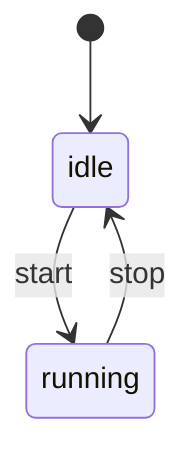

### Feature Spec 模板（适合跨端/协议/状态机）

> 复制本模板创建新 spec。建议文件名：`YYYY-MM-DD_<short-slug>.md` 或 `<feature>.md`。

---

### 1. 背景（Background）

- **为什么要做**：
- **现状问题**：
- **约束**（兼容 legacy HTML/JS？需要 RN？是否影响 bundles？）：

---

### 2. 目标（Goals）

- **必须达成**：
- **可选增强**：

### 3. 非目标（Non-goals）

- **明确不做**：

---

### 4. 范围与影响面（Scope）

- **涉及 packages**：
  - `@N.E.K.O/frontend/packages/<pkg>`
- **涉及宿主**：
  - Web（Vite）/ legacy HTML+JS（bundles+web-bridge）/ React Native（Expo/Metro）
- **是否影响同步**：
  - 是否需要更新 `@N.E.K.O.-RN/scripts/sync-neko-packages.js` 映射？

---

### 5. 术语表（Glossary）

- **术语 A**：定义

---

### 6. 对外接口（Public API / Contract）

#### 6.1 API（函数/类/事件）

- **入口文件**：
  - `index.ts`：
  - `index.web.ts`：
  - `index.native.ts`：
- **导出项**：
  - `export function ...`

#### 6.2 数据结构（Types）

- **类型定义文件**：
  - `src/types.ts`
- **字段约束**：
  - 必填/可选、默认值、错误场景

---

### 7. 行为规范（Behavior）

用“可执行的规则”描述行为，不要写成实现细节。

- **规则 1**：
- **规则 2**：

---

### 8. 状态机（如适用）

---

### 9. 错误码与可观测性（Errors & Observability）

- **错误码**（如果需要）：
  - `CODE_A`: 含义、触发条件、建议处理
- **日志**：
  - 需要记录哪些关键事件/字段（注意脱敏）
- **指标**（可选）：
  - 重连次数、丢包率、耗时分位等

---

### 10. 安全与隐私（Security & Privacy）

- **敏感数据**：Token、音频、截图等
- **脱敏规则**：

---

### 11. 兼容性矩阵（Compatibility）

| 环境 | 是否支持 | 备注 |
|---|---:|---|
| Web(Vite) | ✅/❌ | |
| legacy HTML+JS(UMD) | ✅/❌ | |
| React Native(Expo/Metro) | ✅/❌ | |

---

### 12. 迁移与回滚（Migration / Rollback）

- **迁移步骤**：
- **回滚策略**：

---

### 13. 测试计划（Test plan）

- **单测**：覆盖哪些模块/分支
- **集成测试**：如何验证三端
- **手动验收**：最小可复现步骤

